# SMCS Architecture Document

> **문서 버전:** 1.1 (체크리스트 반영)
> **작성일:** 2026-05-15
> **작성자:** Architect Winston (BMAD)
> **상태:** Validated — Must-Fix 4 + Should-Fix 5 반영 완료
> **입력 문서:** `docs/PRD.md` v0.2
> **참조 문서:** `docs/adr/` (ADR-001 ~ ADR-005)
> **대상 독자:** 개발자(1인 풀스택), 운영 담당자, 향후 합류할 팀원

---

## 0. Executive Summary

SMCS는 **1인 개발 / 1개월 / 사내 폐쇄망 / 70명 사용자** 라는 강한 제약을 가진 내부 CS 이슈 관리 시스템이다. 본 아키텍처는 다음 원칙을 따른다:

1. **Boring Technology 우선** — Spring Boot 3 + PostgreSQL + React + Nginx. 검증된 기술만 사용.
2. **Monolith + Monorepo** — 1인이 풀스택을 운영할 수 있도록 단순화.
3. **External Dependency = 0** — 폐쇄망 운영 가능.
4. **Defense in Depth** — JWT + BCrypt + AES-GCM 컬럼 암호화 + HMAC 검색 해시 + EXIF 스트립.
5. **Living Architecture** — v2에서 SSO, WebSocket, 외부 알림이 추가될 수 있도록 모듈 경계 명확화.

---

## 1. Architecture Principles

| # | 원칙 | 적용 방식 |
|---|------|----------|
| 1 | **Holistic System Thinking** | 사용자 여정(접수 → 배정 → 조치 → 보고서)을 한 코드베이스에서 일관되게 표현 |
| 2 | **User Experience Drives Architecture** | 모바일 현장 작업자의 약한 네트워크가 1순위 제약. 이미지 클라이언트 리사이즈, 업로드 진행률, 재시도 필수 |
| 3 | **Pragmatic Technology Selection** | Spring Boot/React/Postgres = 보수적. WebSocket/Kafka/Redis Cluster = 미사용 (v2 옵션) |
| 4 | **Progressive Complexity** | 패키지 단위 도메인 분리로 v2에서 서비스 분리 시 비용 최소화 |
| 5 | **Cross-Stack Performance** | DB 인덱스(우선순위/접수일 복합), JPA fetch 전략, 프론트 TanStack Query 캐싱 |
| 6 | **Developer Experience First** | `docker compose up` 한 줄로 로컬 실행. Flyway + 시드. README 1페이지로 시작 가능 |
| 7 | **Security at Every Layer** | HTTPS → JWT → 메서드 보안 → 컬럼 암호화 → 감사 로그 → EXIF 스트립 |
| 8 | **Data-Centric Design** | 이슈 라이프사이클이 도메인 중심. IssueEvent로 audit 우선 확보 |
| 9 | **Cost-Conscious Engineering** | 단일 서버 + 단일 컨테이너. 별도 메시지 큐/Redis Cluster/외부 SMTP 비용 0 |
| 10 | **Living Architecture** | Notification 모듈을 인앱 전용으로 구현하되 추후 외부 채널 어댑터 추가 가능한 인터페이스 유지 |

---

## 2. System Context (C4 Level 1)

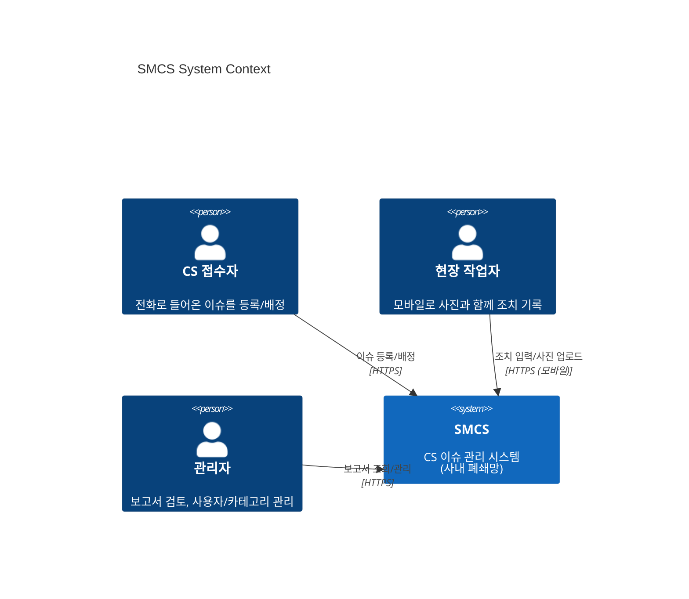

**외부 시스템 연결 없음** — 메신저, SMTP, SMS, SSO, 클라우드 스토리지 등 어떤 외부 시스템과도 통신하지 않는다.

---

## 3. Container Architecture (C4 Level 2)

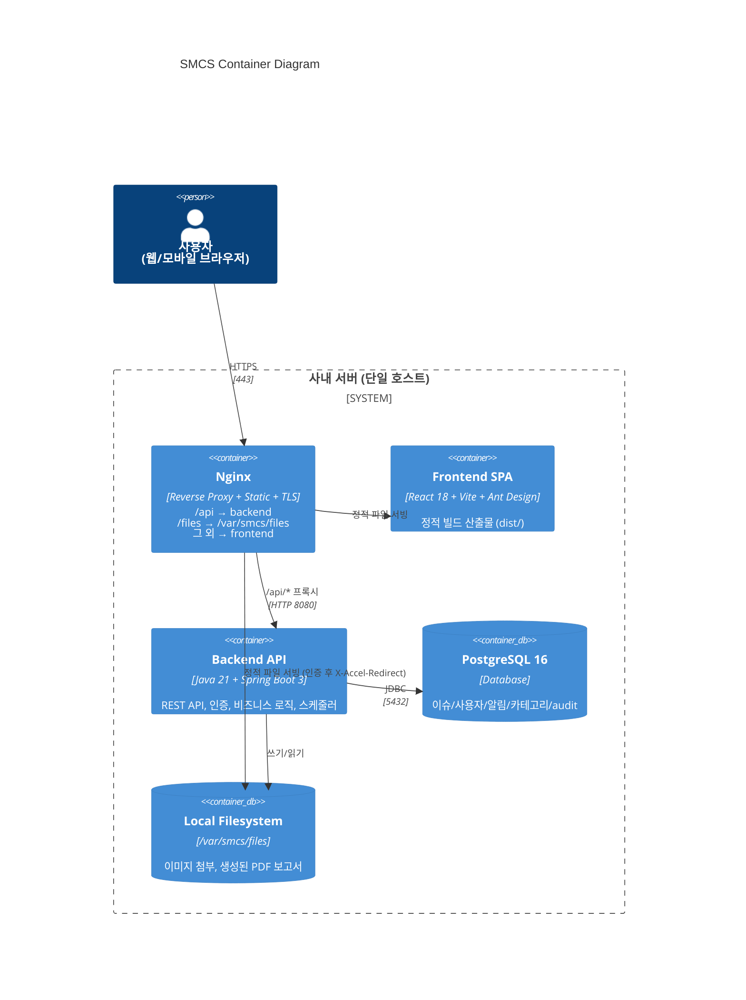

### 3.1 컨테이너 책임

| 컨테이너 | 책임 | 비책임 |
|---------|------|--------|
| **Nginx** | TLS termination, 라우팅, 정적 파일 서빙, 인증 게이트(X-Accel-Redirect) | 비즈니스 로직 |
| **Frontend SPA** | UI 렌더링, 사용자 입력, API 호출, 알림 polling | 인증 검증 (UI만, 권위는 backend) |
| **Backend API** | 인증/권한, 도메인 로직, 트랜잭션, 스케줄러, PDF 생성, 알림 생성 | 정적 파일 직접 서빙(Nginx에 위임) |
| **PostgreSQL** | 영속성 단일 소스 | 검색 엔진(MVP는 LIKE/ILIKE로 충분) |
| **Local Filesystem** | 첨부 이미지, PDF 보고서 저장 | 캐시 (없음 — 항상 디스크) |

### 3.2 왜 Redis를 안 쓰는가?

- 70명 동시 사용에 세션/캐시 필요성 낮음
- JWT가 무상태 → 세션 스토어 불필요
- 폴링 알림은 DB 카운트 쿼리로 충분 (`SELECT COUNT(*) WHERE recipient_id=? AND read_at IS NULL` + 인덱스)
- v2에서 동시 사용자 증가 또는 WebSocket 도입 시 추가 검토

### 3.3 왜 메시지 큐를 안 쓰는가?

- 알림 생성이 동일 트랜잭션 내 INSERT로 충분 (실시간성 요구 낮음, 30s polling)
- 보고서 생성 = Spring `@Scheduled` 한 번에 처리 (분당 1건 미만)
- 외부 발송 없음 → 비동기 분리 동기 부족

---

## 4. Monorepo Directory Structure

```
smcs/
├── README.md                         # 1페이지 셋업/실행 가이드
├── CLAUDE.md                         # 개발 가이드라인 (기존)
├── docs/
│   ├── PRD.md                        # v0.2
│   ├── ARCHITECTURE.md               # 본 문서
│   └── OPERATIONS.md                 # 운영 가이드 (Week 4 작성)
│
├── backend/                          # Spring Boot 모놀리스
│   ├── build.gradle.kts
│   ├── settings.gradle.kts
│   ├── gradle/
│   └── src/
│       ├── main/
│       │   ├── java/com/smcs/
│       │   │   ├── SmcsApplication.java
│       │   │   ├── config/           # SecurityConfig, JpaConfig, WebMvcConfig
│       │   │   ├── common/           # 예외, ErrorResponse, 페이징, 시간 유틸
│       │   │   ├── security/         # JwtService, JwtFilter, UserDetailsService
│       │   │   ├── crypto/           # AesGcmCipher, HmacHasher, EncryptedString JPA Converter
│       │   │   ├── audit/            # IssueEvent AOP/Listener
│       │   │   │
│       │   │   ├── user/             # User 도메인 (엔티티/리포지토리/서비스/컨트롤러)
│       │   │   ├── auth/             # 로그인/로그아웃 컨트롤러
│       │   │   ├── category/         # 3단계 카테고리
│       │   │   ├── issue/            # Issue 도메인
│       │   │   ├── comment/          # Comment 도메인
│       │   │   ├── attachment/       # Attachment 업로드/저장/EXIF 스트립
│       │   │   ├── notification/     # 인앱 알림
│       │   │   ├── report/           # PDF 생성, 스케줄러, 보관함
│       │   │   └── stats/            # 대시보드 통계 API
│       │   │
│       │   └── resources/
│       │       ├── application.yml
│       │       ├── application-local.yml
│       │       ├── application-prod.yml.example
│       │       ├── db/migration/      # Flyway: V1__init.sql, V2__seed_categories.sql, ...
│       │       └── fonts/             # NanumGothic.ttf (PDF 한글 임베드)
│       └── test/
│           └── java/com/smcs/...     # 단위 + 통합 테스트 (Testcontainers)
│
├── frontend/                         # React SPA
│   ├── package.json
│   ├── vite.config.ts
│   ├── tsconfig.json
│   ├── index.html
│   ├── public/
│   └── src/
│       ├── main.tsx
│       ├── App.tsx
│       ├── routes.tsx
│       │
│       ├── api/                      # apiClient (axios 인스턴스), 도메인별 API 함수
│       │   ├── client.ts
│       │   ├── auth.ts
│       │   ├── issues.ts
│       │   ├── notifications.ts
│       │   └── ...
│       │
│       ├── auth/                     # AuthProvider, useAuth, RequireRole
│       ├── shared/                   # UI 키트(PriorityBadge, StatusBadge), 훅, 유틸
│       ├── features/
│       │   ├── issue-list/
│       │   ├── issue-form/
│       │   ├── issue-detail/
│       │   ├── mobile-field/         # 현장 작업자 모바일 화면
│       │   ├── dashboard/
│       │   ├── reports/
│       │   ├── notifications/        # 벨 아이콘 + 알림 페이지
│       │   └── admin/                # users, categories
│       │
│       └── types/                    # API DTO와 동기화된 TS 타입
│
├── docker/
│   ├── Dockerfile.backend            # multi-stage: gradle build → JRE 21 slim
│   ├── Dockerfile.frontend           # multi-stage: node build → nginx with static
│   ├── docker-compose.yml            # prod
│   ├── docker-compose.local.yml      # local dev (DB만)
│   └── nginx/
│       └── nginx.conf
│
└── scripts/
    ├── backup-db.sh                  # pg_dump cron
    ├── cleanup-old-files.sh          # 90일 지난 보고서/알림 정리
    └── seed-prod-data.sh             # 프로덕션 초기 데이터 (카테고리 등)
```

### 4.1 패키지 분리 원칙 (백엔드)

- **도메인 패키지 단위**로 묶고, 각 도메인은 다음을 가질 수 있다:
  - `entity/` — JPA 엔티티
  - `repository/` — Spring Data 리포지토리
  - `service/` — 비즈니스 로직 (트랜잭션 경계)
  - `controller/` — REST 컨트롤러
  - `dto/` — Request/Response DTO
- **도메인 간 직접 의존은 Service 레이어를 통해서만**. 다른 도메인의 Repository/Entity 직접 접근 금지.
- 예: `comment` 도메인이 `issue`를 참조해야 한다면 `IssueService`를 주입받고 `issueRepository`는 직접 사용하지 않는다.

> 이 규칙이 v2에서 도메인을 별도 서비스로 분리할 때 비용을 크게 줄인다.

### 4.2 프론트엔드 구조 (Feature-Sliced)

- **`features/`** 가 최우선 경계. 각 feature 디렉터리 안에 그 feature의 컴포넌트/훅/타입이 자기완결적으로 존재.
- **`shared/`** 는 두 개 이상의 feature가 사용하는 것만. "공통 같아 보여서" 미리 넣지 않는다(YAGNI).
- API 호출은 항상 `api/` 레이어를 통해서만. 컴포넌트에서 직접 `fetch`/`axios` 호출 금지(PRD §9.1).

---

## 5. Data Architecture

### 5.1 ER Diagram

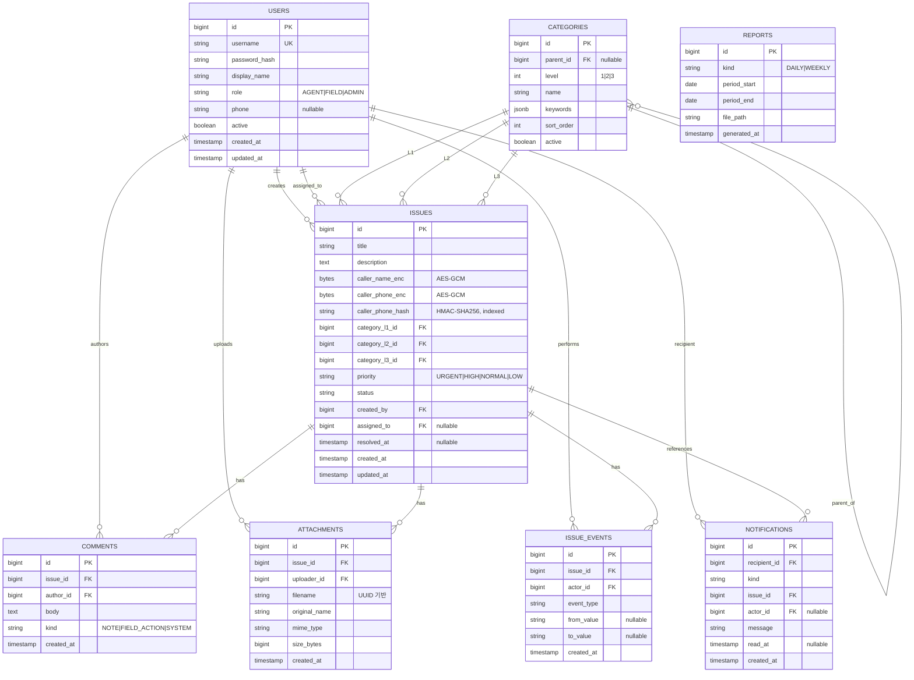

### 5.2 핵심 인덱스 전략

| 테이블 | 인덱스 | 사용처 |
|--------|--------|--------|
| `issues` | `(priority, created_at)` 복합 | 기본 정렬 (PRD FR4) |
| `issues` | `(status)` | 상태 필터 |
| `issues` | `(assigned_to, status)` | 현장 작업자 모바일 홈 |
| `issues` | `(category_l1_id)`, `(category_l2_id)`, `(category_l3_id)` | 카테고리 필터 |
| `issues` | `(caller_phone_hash)` | 발신자 전화번호 검색 |
| `issues` | `(created_at)` | 보고서 집계 |
| `comments` | `(issue_id, created_at)` | 활동 로그 시간순 |
| `attachments` | `(issue_id)` | 첨부 조회 |
| `issue_events` | `(issue_id, created_at)` | audit timeline |
| `notifications` | `(recipient_id, read_at)` | 미읽음 카운트 |
| `notifications` | `(recipient_id, created_at)` | 알림 리스트 |
| `categories` | `(parent_id, level, sort_order)` | 계층 조회 |

### 5.3 검색 전략 (PRD FR15)

| 검색 대상 | 방식 | 비고 |
|----------|------|------|
| 제목 | `ILIKE '%kw%'` | PostgreSQL trigram 인덱스 검토 (선택) |
| 본문 | `ILIKE '%kw%'` | 동상 |
| 발신자 이름 | **검색 불가 (MVP)** | 평문 노출 위험 vs 검색 가치 트레이드오프. 정확 매칭만 v2에서 추가 |
| 발신자 전화번호 | **HMAC 해시 정확 매칭** | 정규화(숫자만) 후 HMAC-SHA256 → `caller_phone_hash` 컬럼 비교 |

> 부분 매칭 전화번호 검색은 보안상 미지원. "010-1234-5678" 입력 시 정확히 그 번호만 매칭.

### 5.4 시드 데이터

- **프로덕션 시드** (Flyway `V2__seed_categories.sql`):
  - L1: 아파트먼트v1, 아파트먼트v2, voip/pbx
  - L2: 관리자웹, 입주민앱, 단말, 서버
  - L3: 기기미동작, 기기오동작, 로그인오류
  - keywords는 빈 배열로 시작 → 운영하면서 Admin이 채움
- **개발 시드** (`application-local.yml` 활성 시 `DataLoader`):
  - 사용자 8명, 샘플 이슈 20건 (다양한 우선순위/카테고리/상태)

### 5.5 데이터 보존 정책

| 데이터 | 보존 기간 | 정리 방식 |
|--------|----------|----------|
| Issue, Comment, Attachment, IssueEvent | **영구** | 삭제하지 않음 |
| Notification | 90일 | 일일 cron `cleanup-old-files.sh` |
| Report PDF | 90일 | 일일 cron |
| Audit Log (별도 로그파일) | 1년 | logrotate |
| DB 백업 | 30일 | `backup-db.sh` 일일 실행, 30일치 보관 |

---

## 6. Security Architecture (Defense in Depth)

### 6.1 보안 계층

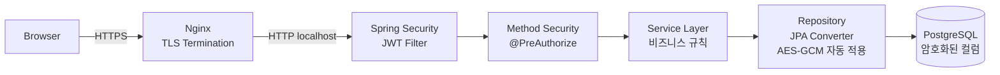

### 6.2 인증 (Authentication)

- **방식:** 사용자명/비밀번호 → JWT
- **토큰 수명:** 8시간 (PRD NFR8)
- **토큰 클레임:** `sub=userId`, `role`, `iat`, `exp`
- **서명:** HMAC-SHA256, 시크릿은 `application-prod.yml` (Git 미포함)
- **저장:** 클라이언트 메모리 + `localStorage` (PRD §1.4 Story 1.4)
- **갱신:** MVP는 만료 시 재로그인. Refresh Token은 v2.
- **비밀번호:** BCrypt (cost 10).

### 6.3 권한 (Authorization)

| 리소스/액션 | AGENT | FIELD | ADMIN |
|------------|:-----:|:-----:|:-----:|
| 이슈 생성 | ✅ | ❌ | ✅ |
| 이슈 조회 (모든) | ✅ | 본인 배정만 | ✅ |
| 이슈 수정 | ✅ | 본인 배정만 (제한적) | ✅ |
| 담당자 배정 | ✅ | ❌ | ✅ |
| 상태 전이 (NEW→ASSIGNED) | ✅ | ❌ | ✅ |
| 상태 전이 (IN_PROGRESS→DONE) | ✅ | 본인 배정 시 | ✅ |
| 검수 (DONE→VERIFIED) | ✅ | ❌ | ✅ |
| 코멘트 작성 | ✅ | ✅ | ✅ |
| 사진 업로드 | ✅ | ✅ | ✅ |
| 보고서 조회 | ❌ | ❌ | ✅ |
| CSV 내보내기 | ❌ | ❌ | ✅ |
| 사용자/카테고리 관리 | ❌ | ❌ | ✅ |

- 구현: Spring Security `@PreAuthorize("hasRole('ADMIN')")` 등 메서드 어노테이션 + 도메인 서비스에서 추가 검증(예: 본인 배정 이슈인지).

### 6.4 컬럼 암호화 (Encryption at Rest)

- **대상 컬럼:** `issues.caller_name_enc`, `issues.caller_phone_enc`
- **알고리즘:** AES-256-GCM (인증된 암호화)
- **키 관리:**
  - MVP: `application-prod.yml`의 환경변수 `SMCS_DATA_KEY` (Base64 32바이트)
  - v2: HashiCorp Vault 또는 사내 KMS 도입
  - **키 회전 절차**는 OPERATIONS.md에 별도 문서화 (재암호화 배치 필요)
- **IV(Nonce):** 매 암호화마다 랜덤 12바이트, ciphertext에 prepend
- **구현:**
  ```java
  // crypto/EncryptedStringConverter.java
  @Converter
  public class EncryptedStringConverter implements AttributeConverter<String, byte[]> {
      // entity 필드는 String, DB 컬럼은 bytea
      // AES-GCM 자동 적용
  }
  ```

### 6.5 검색 해시 (Searchable Encryption)

- **대상:** `issues.caller_phone_hash`
- **알고리즘:** HMAC-SHA256
- **키:** 별도 `SMCS_HMAC_KEY` (암호화 키와 분리)
- **정규화:** 숫자만 추출 후 HMAC 적용 → `01012345678` → HMAC
- **사용:** 검색 시 입력 정규화 → HMAC → `WHERE caller_phone_hash = ?`
- **트레이드오프:**
  - ✅ 정확 매칭 가능, 평문 노출 없음
  - ⚠️ 부분 매칭/와일드카드 불가
  - ⚠️ HMAC 키가 유출되면 rainbow 공격 가능 → 환경변수 보호 필수

### 6.6 파일 업로드 보안

| 단계 | 검증 |
|------|------|
| 클라이언트 | MIME 화이트리스트 (image/jpeg, image/png), 크기 10MB |
| Multipart 파싱 | Spring Boot 기본 (`spring.servlet.multipart.max-file-size=10MB`) |
| 서버 검증 | Magic byte 확인 (JPEG: `FF D8 FF`, PNG: `89 50 4E 47`) — JPEG/PNG 위장 거부 |
| **EXIF 스트립** | `metadata-extractor` 또는 `Thumbnailator` 사용. 메타데이터 모두 제거 후 저장 |
| 저장 파일명 | UUID 기반 (`{uuid}.jpg`), 사용자 입력 파일명 사용 금지 (path traversal 방지) |
| 저장 경로 | `/var/smcs/files/{yyyy}/{mm}/{uuid}.jpg` (월별 디렉터리) |
| 서빙 | Nginx X-Accel-Redirect — Spring이 권한 확인 후 헤더로 위임. 직접 디스크 노출 X |

### 6.7 EXIF 스트립 처리 (사용자 결정에 따라 자동)

```java
// attachment/ExifStripper.java
public byte[] strip(byte[] input, String mimeType) {
    // JPEG: javax.imageio.ImageIO.read → write (메타데이터 자동 손실)
    // 또는 thumbnailator의 .outputQuality(0.95).outputFormat("jpg").asByteArray()
    // PNG: 동일하게 ImageIO로 리라이트
}
```
- 손실 압축 최소화를 위해 JPEG 품질 95 유지
- GPS, 카메라 모델, 촬영 시각 등 모든 메타데이터 제거
- v2에서 GPS 기능이 필요해지면 별도 명시적 필드(`location_lat`, `location_lng`)로 수신

### 6.8 Rate Limiting

**도구:** Bucket4j Spring Boot Starter (in-memory bucket — 단일 호스트 환경에 적합)

| 대상 엔드포인트 | 키 | 제한 | 결과 |
|----------------|------|------|------|
| `POST /api/auth/login` | username + IP 조합 | 5회/10분 | 6회째 → 423 Locked + 카운터 리셋 타이머 |
| `/api/*` (전체) | JWT sub (사용자ID) | 300회/분 | 초과 시 429 Too Many Requests + `Retry-After` 헤더 |
| `POST /api/issues/{id}/attachments` | 사용자ID | 30회/분 | 사진 업로드 폭주 방지 |
| `GET /api/notifications/unread-count` | 사용자ID | 120회/분 | Polling 여유 (30s 정상치의 2배) |

**구현 노트:**
- in-memory Bucket — 재시작 시 카운터 리셋. MVP에 충분.
- 분산 환경 필요 시 v2에서 Redis 기반 Bucket4j로 교체.
- Lockout 상태(`/api/auth/login` 5회 실패)는 DB의 `login_attempt` 테이블에도 기록(감사 + 재기동 시 복원).

### 6.9 기타 보안 설정

| 항목 | 설정 |
|------|------|
| HTTPS | Nginx에서 강제. HTTP → HTTPS 리다이렉트 |
| HSTS | `max-age=31536000; includeSubDomains` |
| CSP | `default-src 'self'; img-src 'self' data:; style-src 'self' 'unsafe-inline'` |
| X-Frame-Options | `DENY` |
| X-Content-Type-Options | `nosniff` |
| CORS | 동일 도메인 배포 → CORS 비활성 (Nginx 프록시) |
| 비밀번호 정책 | 최소 8자, 영문+숫자. 복잡도는 운영 정책 따름 |
| 로그인 실패 lockout | MVP는 단순 카운터 (5회 실패 시 10분 lockout). 분산 환경 고려 X |
| SQL Injection | Spring Data JPA 파라미터 바인딩으로 자동 방지 |
| XSS | React 기본 이스케이프. `dangerouslySetInnerHTML` 사용 금지 |
| 감사 로그 | IssueEvent + 별도 Logback file appender. 개인정보 마스킹 필수 |
| 개인정보 마스킹 (로그) | 전화번호: `010-****-5678`, 이름: `홍*동` |

---

## 7. API Design

### 7.1 설계 원칙

- **REST**, 자원 중심 URL
- **버전 prefix 없음 (MVP)**. v2 도입 시 `/api/v2/...` 추가
- **인증:** 모든 `/api/*` 는 JWT 필수. `permitAll`: `/api/auth/login`, `/api/health`
- **에러 응답:** 표준 포맷
  ```json
  {
    "code": "ISSUE_NOT_FOUND",
    "message": "이슈를 찾을 수 없습니다.",
    "traceId": "abc-123"
  }
  ```
- **페이징:** `?page=0&size=50&sort=priority,desc&sort=createdAt,asc` (Spring Pageable 표준)
- **시간:** ISO-8601 + 오프셋. 서버는 UTC 저장, 응답은 KST(+09:00)
- **검증:** Bean Validation (`@NotBlank`, `@Size`). 실패 시 400 + 필드별 메시지

### 7.2 핵심 흐름별 API

(PRD §6 에 전체 표 있음. 본 문서는 설계 의도만 보강)

| 엔드포인트 | 설계 노트 |
|-----------|----------|
| `POST /api/issues` | 트랜잭션 내에서: ① 이슈 저장 ② IssueEvent(CREATED) 저장 ③ (배정자 있으면) Notification 저장 |
| `POST /api/issues/{id}/transition` | 요청 body: `{ "to": "DONE", "reason": "..." }`. 서버에서 현재 상태 확인 → 유효 전이만 허용 |
| `POST /api/issues/{id}/assign` | `{ "assigneeId": 5 }`. 트랜잭션: 배정 + status=ASSIGNED + Notification |
| `POST /api/issues/{id}/comments` | 트랜잭션: 코멘트 저장 + (작성자 외 관련자에게) Notification |
| `POST /api/issues/{id}/attachments` | Multipart. EXIF 스트립 후 디스크 저장 + DB 메타데이터 |
| `GET /api/notifications/unread-count` | 응답: `{ "count": 7 }`. 단일 COUNT 쿼리. **인덱스 적중 보장** |
| `GET /api/reports/daily?date=...` | Nginx X-Accel-Redirect로 PDF 서빙 |

### 7.3 응답 캐싱 정책

| 엔드포인트 | 캐시 |
|-----------|------|
| 정적 자원 (JS/CSS/이미지) | `Cache-Control: public, max-age=31536000, immutable` (Vite 해시 빌드) |
| `GET /api/*` | 캐시 안 함 (`Cache-Control: no-store`) — 내부 도구 신선도 우선 |
| `GET /files/*` (첨부 이미지) | `Cache-Control: private, max-age=3600` (1시간) |

---

## 8. Sequence Flows

### 8.1 로그인 흐름

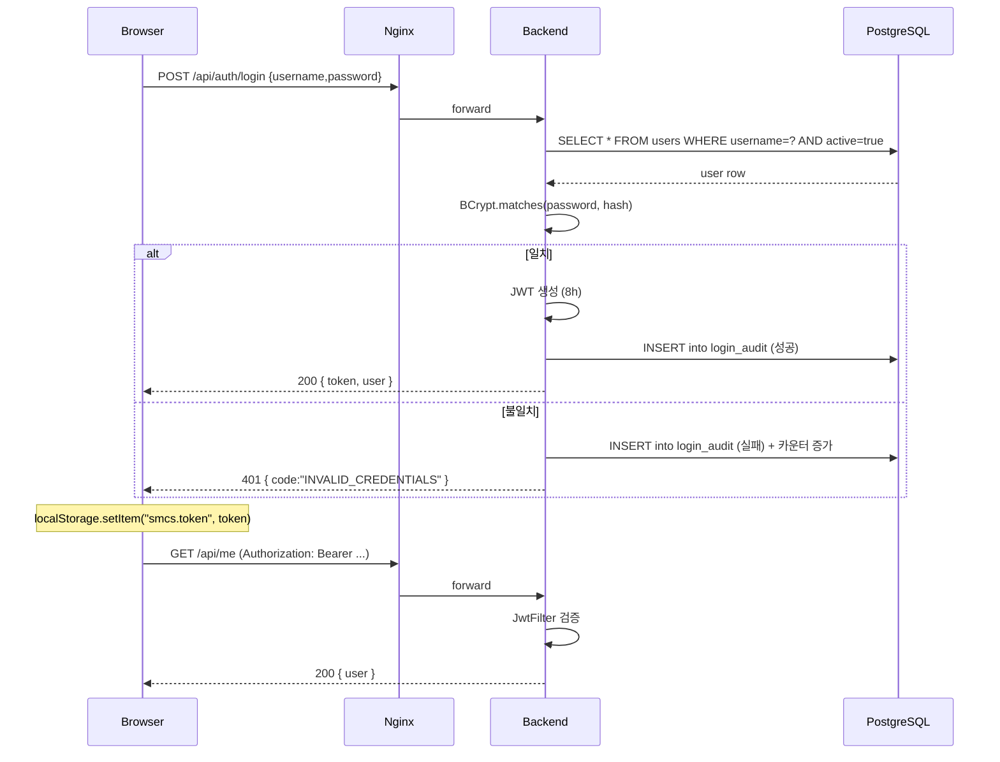

### 8.2 이슈 등록 + 알림 트리거 (배정 포함 시)

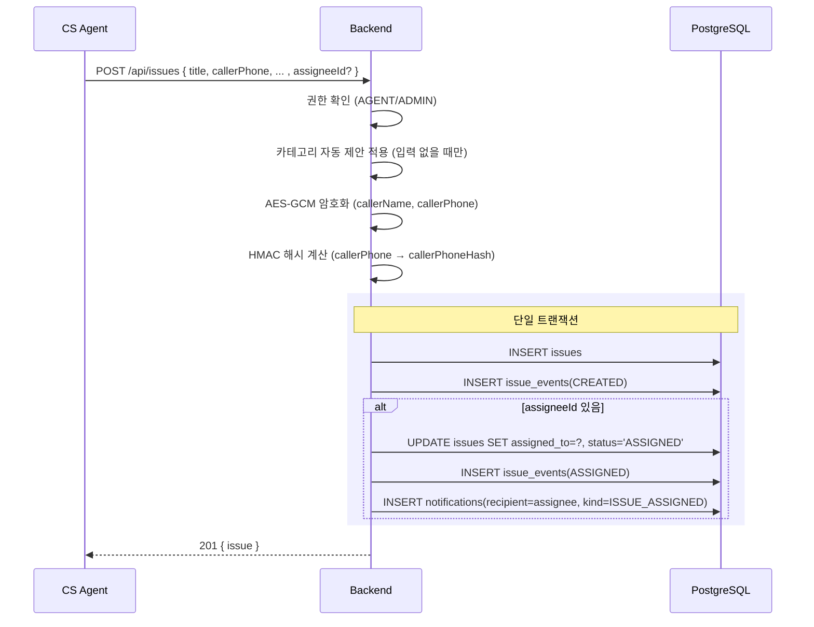

### 8.3 이미지 업로드 (EXIF 스트립 포함)

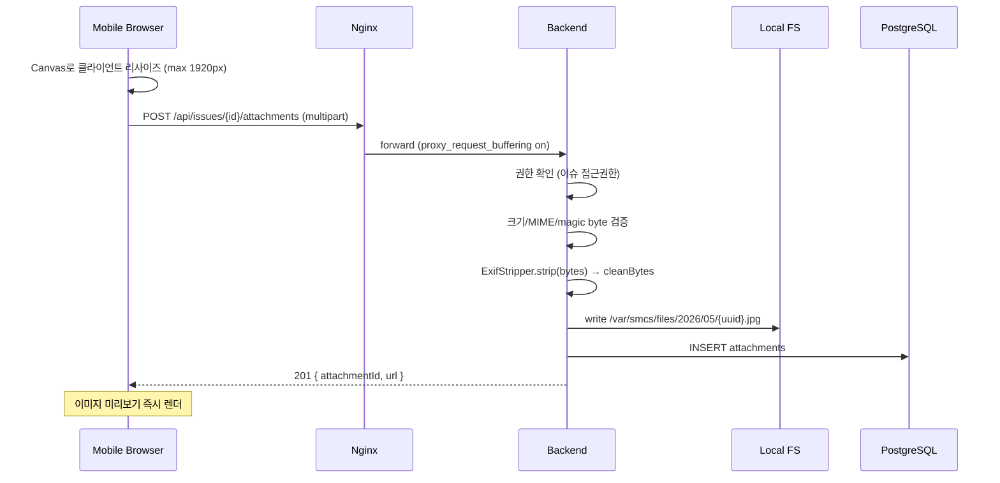

### 8.4 보고서 자동 생성 스케줄러

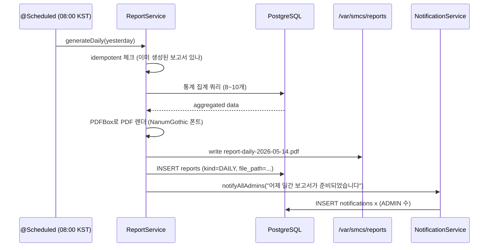

### 8.5 알림 Polling (Frontend)

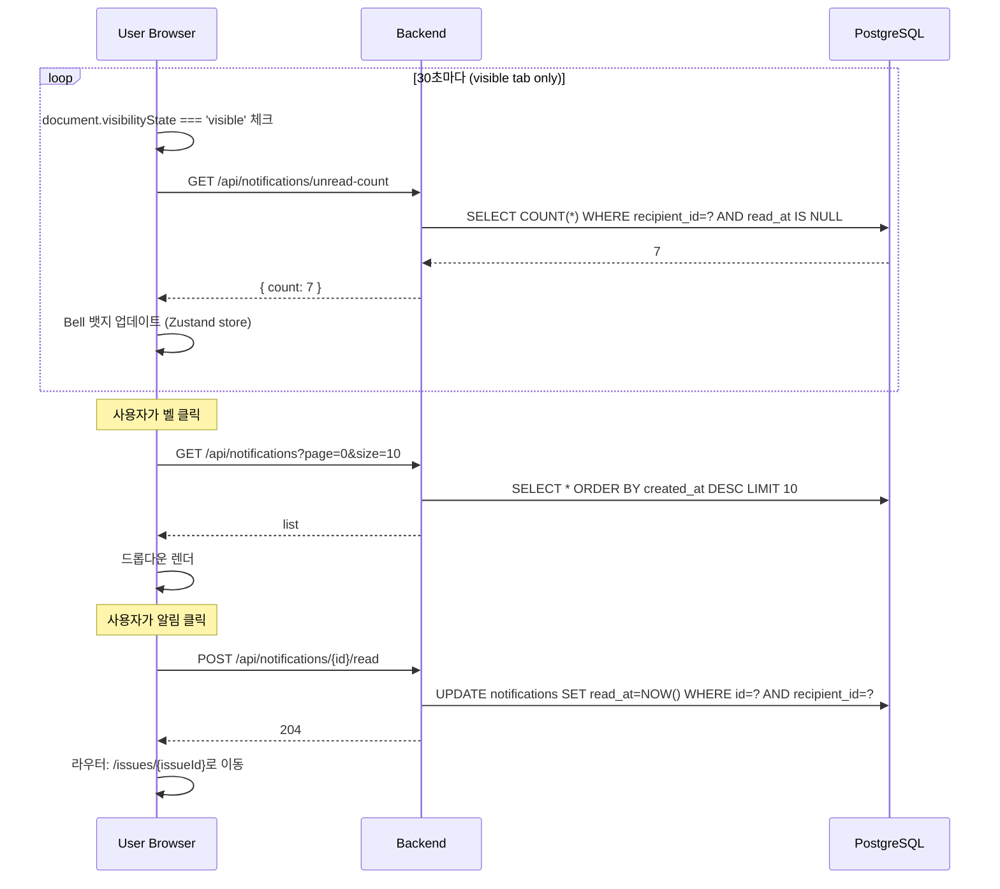

### 8.6 정적 파일 보안 서빙 (X-Accel-Redirect)

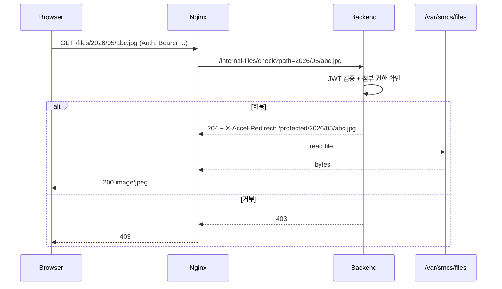

---

## 9. Frontend Architecture

### 9.1 기술 결정

| 영역 | 선택 | 사유 |
|------|------|------|
| 빌드 | Vite | 빠른 dev, 단순한 설정 |
| 라우팅 | React Router 6 | 표준 |
| UI 키트 | Ant Design 5 | 폼/테이블/날짜 피커 풍부, 한국 친화 |
| 서버 상태 | TanStack Query 5 | 캐싱/리페치/스테일 관리 자동 |
| 클라이언트 상태 | Zustand | Redux보다 가벼움, MVP 충분 |
| 폼 | React Hook Form + Zod | 검증 일원화 |
| 차트 | Ant Design Charts (or recharts) | Ant 통합 또는 가벼운 대안 |
| HTTP | axios (인터셉터 사용) | JWT 자동 첨부, 401 자동 로그아웃 |
| 날짜 | dayjs | Ant Design 내부 사용. moment 대체 |
| 타입 | TypeScript 5 strict | 런타임 버그 사전 차단 |

### 9.2 핵심 패턴

#### 9.2.1 API 클라이언트
```typescript
// api/client.ts
const apiClient = axios.create({ baseURL: "/api" });

apiClient.interceptors.request.use((config) => {
  const token = useAuthStore.getState().token;
  if (token) config.headers.Authorization = `Bearer ${token}`;
  return config;
});

apiClient.interceptors.response.use(
  (r) => r,
  (err) => {
    if (err.response?.status === 401) useAuthStore.getState().logout();
    return Promise.reject(err);
  }
);
```

#### 9.2.2 권한 가드
```typescript
// auth/RequireRole.tsx
export function RequireRole({ roles, children }: { roles: Role[]; children: ReactNode }) {
  const user = useAuth();
  if (!user) return <Navigate to="/login" />;
  if (!roles.includes(user.role)) return <Forbidden />;
  return <>{children}</>;
}
```

#### 9.2.3 알림 Polling 훅
```typescript
// features/notifications/useUnreadCount.ts
export function useUnreadCount() {
  return useQuery({
    queryKey: ["notifications", "unread-count"],
    queryFn: () => api.notifications.unreadCount(),
    refetchInterval: 30_000,
    refetchIntervalInBackground: false, // 탭 비활성 시 중단
    staleTime: 25_000,
  });
}
```

#### 9.2.4 우선순위 뱃지 (시각 강조 일관성)
```typescript
// shared/PriorityBadge.tsx
const COLORS: Record<Priority, string> = {
  URGENT: "#ff4d4f", HIGH: "#fa8c16", NORMAL: "#1677ff", LOW: "#8c8c8c",
};
const ICONS: Record<Priority, string> = {
  URGENT: "🔥", HIGH: "⚠️", NORMAL: "•", LOW: "○",
};
export const PriorityBadge = ({ p }: { p: Priority }) => (
  <Tag color={COLORS[p]}>
    <span aria-hidden>{ICONS[p]}</span> {LABELS[p]}
  </Tag>
);
```

### 9.3 모바일 우선 화면 (현장 작업자)

- 별도 경로 `/m/*` 로 분리하여 데스크톱 UI와 코드 분리
- 화면 너비 360px ~ 768px 최적화
- 모든 터치 영역 최소 44x44px
- iOS Safari 자동 캡션 키패드 방지: `inputMode="text"`, viewport meta `user-scalable=no`
- 카메라 접근: `<input type="file" accept="image/*" capture="environment">` — 폰 후방 카메라 직접 호출

### 9.4 클라이언트 이미지 리사이즈

```typescript
// shared/imageResize.ts
async function resize(file: File, maxDim = 1920, quality = 0.85): Promise<Blob> {
  const img = await loadImage(file);
  const scale = Math.min(1, maxDim / Math.max(img.width, img.height));
  const canvas = new OffscreenCanvas(img.width * scale, img.height * scale);
  canvas.getContext("2d")!.drawImage(img, 0, 0, canvas.width, canvas.height);
  return canvas.convertToBlob({ type: "image/jpeg", quality });
}
```

> ⚠️ Canvas 리사이즈도 EXIF를 제거한다. 그래도 서버에서 한 번 더 EXIF 스트립을 수행해 사용자가 원본 업로드를 우회해도 안전하게 한다 (defense in depth).

### 9.5 Routes Table

| 경로 | 컴포넌트 | 필요 권한 | 모바일? | 비고 |
|------|---------|----------|---------|------|
| `/login` | `LoginView` | Public | - | 인증 미통과 시 모든 라우트가 여기로 |
| `/` | (역할별 리다이렉트) | 인증 | - | AGENT/ADMIN → `/issues`, FIELD → `/m` |
| `/issues` | `IssueListView` | AGENT, ADMIN | 데스크톱 | 기본 진입 화면 |
| `/issues/new` | `IssueFormView` | AGENT, ADMIN | 데스크톱 | 단축키 `N`으로 진입 |
| `/issues/:id` | `IssueDetailView` | 인증 (담당자 또는 AGENT/ADMIN) | 양쪽 | 권한 미달 시 403 |
| `/m` | `MobileFieldHomeView` | FIELD, ADMIN | **모바일 우선** | 카드 스택 |
| `/m/issues/:id` | `MobileFieldDetailView` | FIELD 본인 배정 + ADMIN | **모바일 우선** | 사진 첨부 + 조치 |
| `/dashboard` | `DashboardView` | ADMIN | 데스크톱 | 차트 |
| `/reports` | `ReportsListView` | ADMIN | 데스크톱 | 보고서 보관함 |
| `/reports/:kind/:date` | `ReportPreview` | ADMIN | 데스크톱 | PDF iframe + 다운로드 |
| `/notifications` | `NotificationsView` | 인증 | 양쪽 | "모두 보기" |
| `/admin/users` | `AdminUsersView` | ADMIN | 데스크톱 | 사용자 관리 |
| `/admin/categories` | `AdminCategoriesView` | ADMIN | 데스크톱 | L1/L2/L3 탭 |
| `/403` | `ForbiddenView` | - | - | 권한 부족 화면 |
| `*` | `NotFoundView` | - | - | 404 |

**라우트 보호 패턴:**
```typescript
// routes.tsx
<Route path="/issues" element={
  <RequireRole roles={["AGENT", "ADMIN"]}>
    <IssueListView />
  </RequireRole>
} />
<Route path="/m" element={
  <RequireRole roles={["FIELD", "ADMIN"]}>
    <MobileFieldHomeView />
  </RequireRole>
} />
```

**Lazy Loading:**
- Admin과 Reports 라우트는 `React.lazy(() => import(...))`로 분리하여 초기 번들 감소.
- 모바일 라우트(`/m/*`)도 별도 청크로 분리(데스크톱 사용자가 다운받지 않도록).

### 9.6 핵심 공유 컴포넌트 명세

> **위치:** `frontend/src/shared/components/`
> **원칙:** props는 명시적 타입, 합리적 기본값. 내부 상태 최소화. 접근성(ARIA) 기본 내장.

#### 9.6.1 `<PriorityBadge>`

```typescript
interface PriorityBadgeProps {
  priority: Priority;             // "URGENT" | "HIGH" | "NORMAL" | "LOW"
  size?: "sm" | "md";             // 기본 "md"
  showIcon?: boolean;             // 기본 true (색상 의존도 ↓, a11y)
  label?: string;                 // 기본 한글 라벨 ("긴급"/"높음"/"보통"/"낮음")
}
```
- 색상: URGENT `#ff4d4f` / HIGH `#fa8c16` / NORMAL `#1677ff` / LOW `#8c8c8c`
- ARIA: `<span role="status" aria-label="우선순위: 긴급">`
- 사용 위치: 리스트 행, 상세 페이지, 모바일 카드

#### 9.6.2 `<StatusBadge>`

```typescript
interface StatusBadgeProps {
  status: IssueStatus;
  showProgress?: boolean;         // 기본 false. true면 단계 진행 바
}
```
- 색상: NEW `#13c2c2` / ASSIGNED `#1677ff` / IN_PROGRESS `#fa8c16` / DONE `#52c41a` / VERIFIED `#722ed1`
- `showProgress=true` 모드: 이슈 상세 페이지 상단 진행 바 (5단계)
- 키보드 인터랙션 없음 (표시 전용)

#### 9.6.3 `<CategoryPicker>` (3단계 통합)

```typescript
interface CategoryPickerProps {
  value: { l1?: number; l2?: number; l3?: number };
  onChange: (v: { l1?: number; l2?: number; l3?: number }) => void;
  required?: boolean;             // 기본 true
  disabled?: boolean;
  layout?: "horizontal" | "vertical";
}
```
- 내부적으로 3개 Ant Design `<Select>` 렌더. 자유 조합 허용.
- 자동 카테고리 제안은 부모 컴포넌트가 `value`를 갱신하는 방식 (이 컴포넌트는 stateless).
- 각 Select에 `aria-label` 명시 ("대분류", "중분류", "소분류")

#### 9.6.4 `<UserSelect>`

```typescript
interface UserSelectProps {
  value?: number;
  onChange: (userId: number | undefined) => void;
  filter?: { roles?: Role[]; activeOnly?: boolean };
  placeholder?: string;
  allowClear?: boolean;
}
```
- Ant Design `<Select>` 기반 검색 가능 드롭다운
- 내부에서 `useUsers({ roles, activeOnly })` 훅으로 데이터 로딩 (TanStack Query 캐시)
- 담당자 배정 화면에서 `filter={{ roles: ["FIELD"], activeOnly: true }}` 형태로 사용

#### 9.6.5 `<IssueCard>` (모바일 우선)

```typescript
interface IssueCardProps {
  issue: IssueSummary;            // 리스트용 경량 DTO
  onClick?: () => void;
  showAssignee?: boolean;         // 기본 true
  compact?: boolean;              // 기본 false. true는 모바일 작은 카드
}
```
- 모바일 카드 스택과 데스크톱 카드 뷰에서 공통 사용
- 좌측 우선순위 색상 막대 + 제목 + 카테고리 + 접수 시각
- 터치 영역 최소 44x44px (`role="button"`, `tabIndex=0`, Enter/Space 키 처리)

#### 9.6.6 기타 공유 유틸

- `<EmptyState message icon />` — 데이터 0건일 때 일관된 빈 상태 (PRD §3.2 FR10 차트 요구)
- `<ErrorBoundary />` — feature 단위로 감싸 한 화면의 에러가 전체 앱을 죽이지 않도록
- `<ConfirmModal />` — 위험 액션(재오픈, 비활성화)에 사용

### 9.7 Frontend Performance Patterns

| 기법 | 적용 위치 | 비고 |
|------|----------|------|
| **Code Splitting (route-level)** | `routes.tsx`에서 `React.lazy(() => import(...))` | Admin/Reports/모바일은 별도 청크 |
| **Vendor Splitting** | `vite.config.ts`의 `manualChunks` | `react`, `antd`, `tanstack-query`를 별도 청크 |
| **Lazy Loading (이미지)** | `` | 첨부 이미지 갤러리에서 |
| **TanStack Query 캐싱** | 모든 GET 요청 | `staleTime` 적정값(이슈 리스트 30s, 카테고리 5min, 사용자 5min) |
| **Polling 최적화** | 알림 카운트 polling | `refetchIntervalInBackground: false` — 비활성 탭 중단 |
| **React.memo** | `<IssueCard>`, `<PriorityBadge>` | 리스트 재렌더 방지 |
| **Virtualization** | `<IssueListTable>` (50건/페이지면 불필요) | v2 페이지당 1000건 필요 시 `react-window` 도입 |
| **Ant Design Icons Tree-shaking** | 개별 import (`import { BellOutlined } from '@ant-design/icons'`) | 전체 import 금지 |
| **이미지 클라이언트 리사이즈** | `attachment-upload` feature | 모바일 업로드 트래픽 ↓ |
| **HTTP/2 + gzip + brotli** | Nginx 설정 | 정적 자원 압축 |

**번들 크기 가드레일:**
- 초기 진입 청크: < 300 KB (gzip 후)
- 라우트별 lazy 청크: < 150 KB
- Vite build 시 `--report` 또는 `rollup-plugin-visualizer`로 시각화

### 9.8 Accessibility Implementation Guide

> **목표:** WCAG 2.1 Level A (PRD §3.4)
> **원칙:** Ant Design 기본 ARIA를 신뢰하되, 커스텀 컴포넌트는 명시적 ARIA 작성.

#### 9.8.1 시맨틱 HTML

- 페이지 헤더: `<header>`, 본문: `<main>`, 사이드: `<aside>`, 푸터: `<footer>`
- 클릭 가능한 요소는 `<button>` 또는 `<a>`. 절대 `<div onClick>` 사용 금지.
- 폼은 반드시 `<form>` + `<label htmlFor>` + 명시적 `id`

#### 9.8.2 키보드 네비게이션

| 요구사항 | 구현 |
|---------|------|
| 모든 인터랙티브 요소에 키보드 도달 가능 | `tabIndex=0`. 비활성은 `tabIndex=-1` |
| Tab 순서가 시각적 순서와 일치 | DOM 순서 = 시각 순서. CSS `order` 사용 금지 |
| 포커스 표시 | Ant Design 기본 outline 유지. `outline: none` 금지 |
| 모달 진입 시 자동 포커스 | Ant Design `<Modal>` 기본 동작. 닫힐 때 호출자로 복귀 |
| Esc로 모달 닫기 | Ant Design 기본 |
| 단축키 가이드 | `?` 또는 `Ctrl+/` 누르면 단축키 도움말 모달 |

#### 9.8.3 ARIA 가이드

- **명명(Naming):** 아이콘만 있는 버튼은 `aria-label` 필수 (예: 벨 아이콘 `aria-label="알림"`)
- **상태(State):** 토글/탭 등은 `aria-selected`, `aria-expanded` 명시
- **라이브 영역:** Toast/Notification은 `role="status"` 또는 `aria-live="polite"`
- **숨김:** 시각적으로만 보이고 스크린리더 무시할 요소는 `aria-hidden="true"`. 반대는 `.sr-only` 클래스 (visually-hidden)
- **랜드마크:** `<header>`, `<nav>`, `<main>`, `<aside>`, `<footer>` 사용 (또는 `role` 명시)

#### 9.8.4 색상 대비 & 시각

- 텍스트 대비비 최소 **4.5:1** (Level AA 목표는 v2, MVP는 A인 3:1을 초과하되 가능하면 4.5)
- **색상에 의존하지 않는 정보 전달:** 우선순위/상태는 색상 + 텍스트 라벨 + 아이콘 3중 표시 (PRD FR16)
- 다크모드는 v2. MVP는 라이트만.

#### 9.8.5 자동 테스트

- **개발 모드:** `@axe-core/react`로 콘솔 경고. `main.tsx`:
  ```typescript
  if (process.env.NODE_ENV === "development") {
    import("@axe-core/react").then(({ default: axe }) =>
      axe(React, ReactDOM, 1000)
    );
  }
  ```
- **수동 검증:** 키보드만으로 골든 패스(로그인 → 이슈 등록 → 조치 → 완료) 통과 확인 (Story 4.7 AC 추가)
- **스크린리더 검증:** macOS VoiceOver 또는 Windows Narrator 1회 통과 권장 (MVP 필수 아님)

#### 9.8.6 모바일 특화

- 터치 영역 최소 **44x44px** (WCAG 2.5.5)
- `<input type="tel">`, `inputMode="numeric"` 등 키보드 힌트 명시
- 뷰포트: `<meta name="viewport" content="width=device-width, initial-scale=1, viewport-fit=cover">` (user-scalable 강제 X — a11y 원칙)

---

## 10. Deployment Architecture

### 10.1 토폴로지 (단일 호스트)

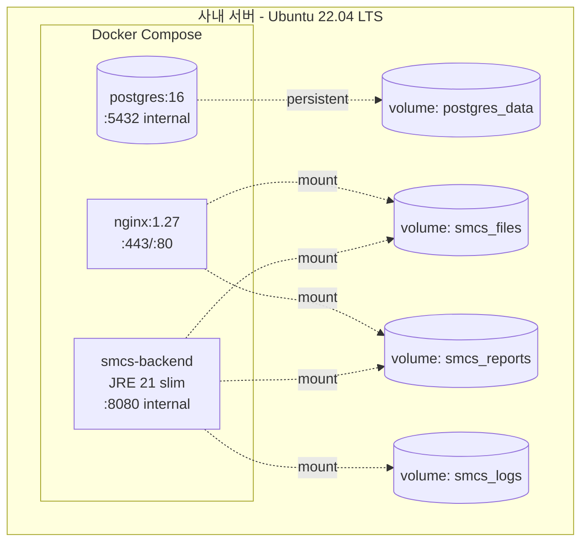

### 10.2 docker-compose.yml (요약)

```yaml
services:
  nginx:
    image: nginx:1.27-alpine
    ports: ["80:80", "443:443"]
    volumes:
      - ./nginx/nginx.conf:/etc/nginx/nginx.conf:ro
      - ./certs:/etc/nginx/certs:ro
      - smcs_files:/var/smcs/files:ro
      - smcs_reports:/var/smcs/reports:ro
      - ./frontend-dist:/usr/share/nginx/html:ro
    depends_on: [backend]
    restart: unless-stopped

  backend:
    image: smcs-backend:latest
    environment:
      SPRING_PROFILES_ACTIVE: prod
      SPRING_DATASOURCE_URL: jdbc:postgresql://postgres:5432/smcs
      SPRING_DATASOURCE_USERNAME: smcs
      SPRING_DATASOURCE_PASSWORD_FILE: /run/secrets/db_password
      SMCS_DATA_KEY_FILE: /run/secrets/data_key
      SMCS_HMAC_KEY_FILE: /run/secrets/hmac_key
      SMCS_JWT_SECRET_FILE: /run/secrets/jwt_secret
      TZ: Asia/Seoul
    secrets: [db_password, data_key, hmac_key, jwt_secret]
    volumes:
      - smcs_files:/var/smcs/files
      - smcs_reports:/var/smcs/reports
      - smcs_logs:/var/smcs/logs
    depends_on: [postgres]
    restart: unless-stopped

  postgres:
    image: postgres:16-alpine
    environment:
      POSTGRES_DB: smcs
      POSTGRES_USER: smcs
      POSTGRES_PASSWORD_FILE: /run/secrets/db_password
      TZ: Asia/Seoul
    volumes:
      - postgres_data:/var/lib/postgresql/data
    secrets: [db_password]
    restart: unless-stopped

volumes:
  postgres_data:
  smcs_files:
  smcs_reports:
  smcs_logs:

secrets:
  db_password:
    file: ./secrets/db_password
  data_key:
    file: ./secrets/data_key
  hmac_key:
    file: ./secrets/hmac_key
  jwt_secret:
    file: ./secrets/jwt_secret
```

### 10.3 Nginx 핵심 라우팅 (요약)

```nginx
server {
    listen 443 ssl http2;
    server_name smcs.internal;

    ssl_certificate     /etc/nginx/certs/smcs.crt;
    ssl_certificate_key /etc/nginx/certs/smcs.key;
    add_header Strict-Transport-Security "max-age=31536000" always;

    # SPA
    root /usr/share/nginx/html;
    location / {
        try_files $uri /index.html;
    }

    # API
    location /api/ {
        proxy_pass http://backend:8080;
        proxy_set_header X-Real-IP $remote_addr;
        client_max_body_size 11m;  # 첨부 10MB + 여유
    }

    # 첨부 파일 — X-Accel-Redirect 경로
    location /files/ {
        auth_request /api/files/check;
        return 302 /protected$uri;
    }
    location /protected/ {
        internal;
        alias /var/smcs/files/;
        expires 1h;
    }

    # 보고서 PDF — 동일 패턴
    location /reports/ {
        auth_request /api/files/check?type=report;
        return 302 /protected-reports$uri;
    }
    location /protected-reports/ {
        internal;
        alias /var/smcs/reports/;
    }
}

server {
    listen 80;
    return 301 https://$host$request_uri;
}
```

### 10.4 빌드 & 배포 워크플로우

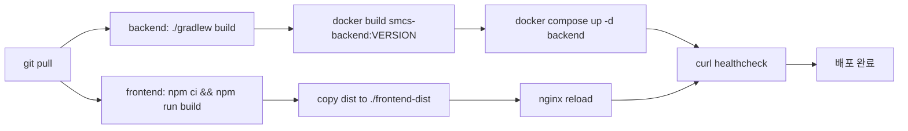

- MVP는 **수동 배포** (1인 개발). CI/CD는 v2.
- 무중단 배포 불필요. 야간 점검 시간(00:00~01:00) 활용.
- 롤백: 이전 이미지 태그로 `docker compose up -d` 재실행.

### 10.5 백업 & 복구

| 대상 | 방식 | 주기 | 보관 | 암호화 |
|------|------|------|------|--------|
| PostgreSQL | `pg_dump -Fc \| gpg --symmetric --cipher-algo AES256` | 매일 02:00 | 30일 | ✅ GPG (대칭키) |
| 첨부 파일 | `tar czf - … \| gpg --symmetric` → 백업 서버 또는 외장 스토리지 | 매일 03:00 | 90일 | ✅ GPG |
| 보고서 PDF | 동일 방식 | 매일 03:00 | 90일 (원본도 90일 후 삭제) | ✅ GPG |
| 시크릿 | 별도 보안 저장소 (사내 패스워드 매니저) | 변경 시 | 영구 | ✅ (매니저 자체 암호화) |

**백업 복호화 키 관리:**
- GPG 대칭키 패스프레이즈는 **백업 저장소와 분리된 위치**(사내 패스워드 매니저)에 보관.
- DB 마스터키(`SMCS_DATA_KEY`)와 백업 GPG 키는 **다른 키**로 분리한다 (열쇠 한 개로 모든 곳 열리지 않도록).
- 키 회전 절차는 OPERATIONS.md에 명시.

**가용성(NFR5) 운영 정의:**
- **목표 가동률:** 월간 99% (다운타임 ≤ 7시간/월)
- **제외 대상:** 사전 공지된 계획 점검 (주간 30분 이내, 야간 00:00~01:00), 사내 네트워크/인프라 장애
- **RTO(복구 목표 시간):** 4시간 — Docker Compose 재기동 + 백업 복원 시나리오 기준
- **RPO(복구 시점 목표):** 24시간 — 일일 백업 기준 (최대 24시간 분량 데이터 손실 허용)
- **단일 호스트 SPOF 인지:** MVP는 단일 호스트로 운영. 99.9%+ 가동률이 필요해지면 v2에서 (a) DB 분리, (b) Backup Hot-Standby 도입 검토.

복구 절차 상세는 OPERATIONS.md에 별도 작성.

---

## 11. Performance Considerations

### 11.1 목표 vs 예상

| 메트릭 | PRD 목표 | 아키텍처 분석 | 충분성 |
|--------|---------|-------------|--------|
| 동시 사용자 | 70명 | Spring Boot 단일 인스턴스 (Tomcat 200 thread default) | ✅ 충분 |
| 페이지 응답 P95 | < 1.5초 | DB 인덱스 적중 + Nginx HTTP/2 | ✅ 충분 |
| 통계 API P95 | < 500ms | 일/주 단위 집계, 인덱스 사용, 캐시 없음 | ✅ MVP 충분, v2에서 materialized view 검토 |
| 모바일 사진 업로드 | 진행률 표시 + 재시도 | 클라이언트 리사이즈 + axios onUploadProgress | ✅ |
| 이슈 등록 → 알림 카운트 반영 | < 30초 (polling) | 동일 트랜잭션 INSERT + 30s polling | ✅ |
| **월간 가동률** | **99%** (NFR5) | 단일 호스트 + 일일 백업 + RTO 4h | ✅ 99% 달성 가능 (99.9%+ 불가 — 단일 호스트 SPOF) |
| **RTO** | **4시간** | Docker Compose 재기동 + pg_restore + 파일 rsync | ✅ |
| **RPO** | **24시간** | 일일 02:00 백업 | ✅ |

### 11.2 잠재 병목

- **이슈 리스트 ILIKE 검색** — 50,000건 이상 시 trigram 인덱스 도입 검토 (v2)
- **30초 polling 부하** — 70명 × 분당 2회 = 140 req/min. 부하 무시 가능
- **PDF 생성** — 70명 1일치 데이터로 PDF는 1초 미만 예상. 1년 누적 시 점진적 슬로우 가능 → 보고서 데이터 캐싱(v2)
- **이미지 업로드 트래픽** — 평균 1~2MB(리사이즈 후) × 1일 50건 = 무시 가능

### 11.3 성능 모니터링

| 도구 | 용도 |
|------|------|
| Spring Boot Actuator | `/actuator/health`, `/actuator/metrics` (내부 토큰 보호) |
| PostgreSQL `pg_stat_statements` | 슬로우 쿼리 추적 |
| Nginx access log | 응답 시간 P50/P95 모니터링 |
| 외부 APM | **미사용** (외부 의존성 0 원칙) |

---

## 12. Developer Experience

### 12.1 로컬 실행 (목표: 1분 이내)

```bash
# 최초 1회
git clone ... && cd smcs
cp backend/src/main/resources/application-prod.yml.example backend/src/main/resources/application-prod.yml.local

# 매일
docker compose -f docker/docker-compose.local.yml up -d   # postgres만 띄움
cd backend && ./gradlew bootRun --args="--spring.profiles.active=local"
cd frontend && npm run dev   # Vite :5173, /api는 :8080으로 proxy
```

### 12.2 시드 데이터 활용

- `application-local.yml` 프로파일에서 `DataLoader` Bean이 자동 실행
- 8명 사용자 (각 역할별), 20건 다양한 상태/우선순위/카테고리 조합 이슈
- 비밀번호는 모두 `dev1234` (로그에 표시)
- 매 부팅마다 reset (선택)

### 12.3 코드 품질 도구

| 도구 | 적용 |
|------|------|
| Spotless (Java) | google-java-format 자동 적용 |
| ktlint | 미사용 (Java 단일) |
| ESLint + Prettier | 프론트엔드 자동 적용 |
| Pre-commit (선택) | husky + lint-staged |

### 12.4 디버깅

- Backend: IntelliJ + Spring Boot run config
- Frontend: Chrome DevTools + React DevTools
- DB: pgAdmin 또는 DBeaver
- API: REST Client (VSCode 확장) — `.http` 파일을 `docs/api-samples/` 에 보관

---

## 13. Migration & Future Evolution Path

| 가능성 | v2 트리거 | 아키텍처 변경 |
|--------|----------|--------------|
| 사용자 1,000명+ | 성장 | Backend 수평 확장 (Stateless 유지, JWT 변경 불필요), DB read replica |
| 실시간 알림 필요 | UX 피드백 | WebSocket(STOMP) 또는 SSE 추가. NotificationModule에 publisher 인터페이스 추가 |
| 외부 채널 통합 | 사용자 요청 | `NotificationChannel` 인터페이스에 KakaoworkChannel/SlackChannel 구현 추가 |
| SSO | 보안 정책 | Spring Security OAuth2 Resource Server 추가, 자체 인증과 병행 가능 |
| 보고서 데이터 폭증 | 1년+ 누적 | `report_daily_snapshot` 테이블 도입, 매일 집계 미리 저장 |
| 카테고리 매트릭스 룰 | 운영 분석 | `category_combination` 테이블 도입 |
| GPS/현장 위치 | v2 요구 | `issue_location` 별도 테이블, EXIF 보존 정책 재검토 (현재는 스트립) |
| 마이크로서비스 분리 | 팀 규모 증가 | `report`, `notification` 부터 분리. 이미 도메인 패키지 경계 명확 |

> **핵심:** MVP는 단순하게 만들었지만, **도메인 경계가 명확**하므로 모든 진화 경로의 비용이 낮다.

---

## 14. Open Questions & Assumptions

### 14.1 명시적 가정

1. **인증서:** 사내 CA 또는 사설 인증서. Let's Encrypt는 폐쇄망에서 불가.
2. **시간 동기화:** 서버 NTP 설정이 사내 정책에 따라 이미 되어 있음.
3. **사내 서버 사양:** 4 vCPU / 8GB RAM / 200GB SSD 가정 (Java + Postgres + Nginx 단일 호스트 적정).
4. **사용자 비밀번호 발급:** Admin이 초기 비밀번호 생성 → 사용자에게 별도 채널(사내 전달)로 공유. 비밀번호 변경 강제는 v2.
5. **모바일 사용자 통신 환경:** 4G LTE 이상. 2G/3G 대응 안 함.
6. **저장 데이터 보존 의무:** 법적 보존 의무 없음 가정. 있다면 90일 정리 정책 재검토 필요.

### 14.2 사용자 확인 필요 항목

- [ ] **사내 서버 OS/사양** 실제 확정 (현재 Ubuntu 22.04 가정)
- [ ] **인증서 발급 방식** (사내 CA / 사설 인증서)
- [ ] **백업 저장 위치** (동일 호스트? 별도 백업 서버? 외장?)
- [ ] **HTTPS 도메인** (예: `smcs.internal`, `smcs.company.local`)
- [ ] **법적 데이터 보존 의무** 유무

---

## 15. Next Steps

### 15.1 Story 1.1 시작 전 준비물

| # | 항목 | 담당 |
|---|------|------|
| 1 | 사내 서버 사양/OS 확정 | 개발자 + 인프라 |
| 2 | 도메인 + 인증서 발급 | 인프라 |
| 3 | 시크릿 4종 생성 (data_key, hmac_key, jwt_secret, db_password) | 개발자 |
| 4 | 로컬 개발 환경 (Java 21 JDK, Node 20, Docker Desktop) | 개발자 |
| 5 | Git 저장소 생성 | 개발자 |

### 15.2 다음 BMAD 에이전트

1. **SM (Scrum Master)** — Story 1.1을 즉시 실행 가능한 작은 작업으로 분해
2. **UX Expert** — 핵심 화면 와이어프레임 (이슈 리스트, 모바일 카드, 보고서 미리보기)
3. **Dev** — Story 1.1 (프로젝트 셋업) 즉시 구현 시작
4. **PO (Product Owner)** — PRD/Architecture 정합성 검토 + 백로그 우선순위 확정

---

**문서 끝.**
