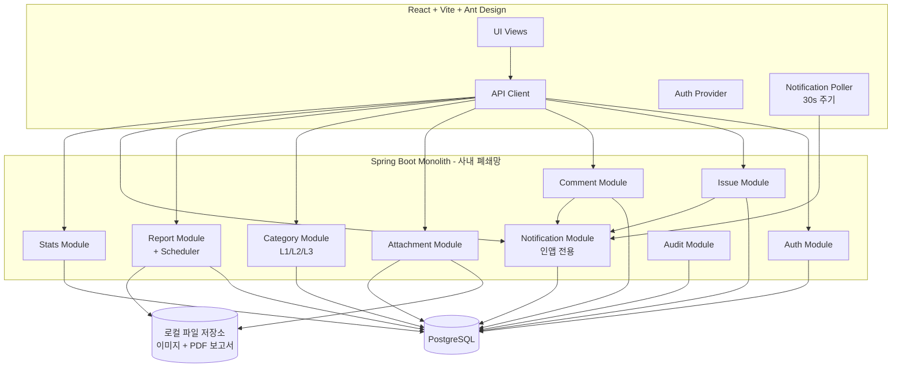

# SMCS (Service Management & CS System) Product Requirements Document (PRD)

> **문서 버전:** 0.2 (User Feedback Reflected)
> **작성일:** 2026-05-15
> **작성자:** PM John (BMAD)
> **상태:** 초안 v0.2 — 사용자 1차 피드백 반영

---

## 1. 목표 & 배경 (Goals and Background Context)

### 1.1 Goals

- 전화로 접수된 CS 이슈를 **엑셀 수기 기록에서 디지털 통합 시스템으로 전환**한다.
- **CS 접수자와 현장 작업자가 하나의 이슈 카드**에서 협업하는 라이프사이클 트래킹을 제공한다.
- **자동 일/주간 이슈 보고서**를 통해 관리자가 별도 작업 없이 인사이트를 얻게 한다.
- 1개월 안에 **실사용 가능한 MVP**를 배포하고, 도입 1개월 후 엑셀 사용 0건을 달성한다.
- 70명 규모(CS 20 + 현장 50)의 내부 사용자를 안정적으로 지원한다.

### 1.2 Background Context

현재 자사 CS 운영은 전화로 들어온 이슈를 직원이 엑셀 파일에 수기로 기록하는 방식이다. 이로 인해 (1) 이슈 누락과 중복, (2) 담당자 배정 및 진행 상태 추적의 어려움, (3) 현장 작업자의 조치 내용이 별도 채널로 분산되는 핸드오프 단절, (4) 통계 및 보고서 작성을 위해 매주 수 시간을 수동 집계에 소비하는 비효율이 발생하고 있다.

SMCS는 **CS 접수와 현장 조치를 하나의 이슈 카드로 통합**하고, **자동 보고서**로 관리자의 의사결정을 가속화하는 내부 도구다. 음성 자동분석과 같은 고도화 기능은 v2로 미루고, 1개월 MVP는 **"엑셀 탈출 + 통합 워크플로우 + 자동 보고서"** 세 가지 핵심 가치에 집중한다.

### 1.3 Change Log

| Date       | Version | Description                                                                                                                                                | Author      |
| :--------- | :------ | :--------------------------------------------------------------------------------------------------------------------------------------------------------- | :---------- |
| 2026-05-15 | 0.1     | Initial draft                                                                                                                                              | PM John     |
| 2026-05-15 | 0.2     | 사용자 피드백 반영: 외부 알림 제거(인앱만), Ant Design 확정, SLA 정책 제거(우선순위 색상/정렬로 대체), 카테고리 3단계 계층화, 보고서 이메일 발송 제거 | PM John     |

---

## 2. Requirements

### 2.1 Functional Requirements (FR)

- **FR1:** 시스템은 인증된 사용자가 신규 이슈 카드를 등록할 수 있도록 한다. 필수 필드: 제목, 발신자명, 발신자 전화번호, 카테고리(대/중/소 3단계), 우선순위, 상세 내용.
- **FR2:** 이슈는 다음 상태값을 가진다: `접수(NEW)` → `배정(ASSIGNED)` → `진행중(IN_PROGRESS)` → `완료(DONE)` → `검수(VERIFIED)`. 단방향 및 일부 역방향 전이가 가능해야 한다(예: 완료 → 진행중 재오픈).
- **FR3:** CS 접수자는 이슈에 현장 작업자(담당자)를 수동으로 배정할 수 있다.
- **FR4:** 시스템은 이슈 리스트를 테이블 뷰로 제공하며, **기본 정렬은 우선순위 내림차순(URGENT → LOW) → 접수일 오름차순**이다. 상태/카테고리(대/중/소)/담당자/날짜 범위로 필터링 가능해야 한다.
- **FR5:** 시스템은 이슈 상세 페이지에서 모든 상태 변경, 코멘트, 첨부 파일을 시간순으로 보여주는 활동 로그(timeline)를 제공한다.
- **FR6:** 현장 작업자는 모바일 반응형 화면에서 본인에게 배정된 이슈를 조회하고, 조치 내용을 입력하며, 사진(여러 장)을 첨부하고, 이슈를 완료 처리할 수 있다. 모바일 리스트도 기본 정렬은 **우선순위 내림차순**이다.
- **FR7:** 시스템은 카테고리 3단계 계층 구조(L1 대분류 → L2 중분류 → L3 소분류)를 지원하며, 카테고리 마스터의 키워드 룰을 사용하여 신규 이슈에 적절한 카테고리를 자동 제안한다(사용자 수정 가능, AI/LLM 미사용). MVP 초기 데이터는 데이터 모델 섹션 참고.
- **FR8:** 시스템은 매일 정해진 시각(기본 08:00 KST)에 전일 이슈 통계 보고서(PDF)를 **자동 생성**하여 시스템 내 보고서 보관함에 적재한다. 외부 발송(이메일/메신저)은 하지 않는다.
- **FR9:** 시스템은 주간 보고서(매주 월요일 08:00 KST)와 임원용 1장 요약 보고서를 자동 생성하여 보고서 보관함에 적재한다.
- **FR10:** 시스템은 대시보드 화면에서 오늘/이번주/이번달 신규/처리/미처리 이슈 수, 카테고리(대분류 기준)별 분포 차트, 담당자별 처리량을 표시한다.
- **FR11:** 시스템은 **인앱 알림(In-app Notification)**을 제공한다. 헤더의 벨 아이콘에 미읽음 카운트 뱃지가 표시되고, 클릭 시 알림 드롭다운(또는 페이지)으로 이슈 배정/코멘트/상태 변경 알림을 확인할 수 있다. 외부 채널(카카오워크, 슬랙, 이메일, SMS) 발송은 하지 않는다.
- **FR12:** 시스템은 코멘트 기능을 제공하여 CS 접수자와 현장 작업자가 이슈 카드 내에서 협업할 수 있도록 한다. 코멘트 작성 시 관련 사용자(담당자, 이슈 생성자)에게 인앱 알림이 전달된다.
- **FR13:** 시스템은 이슈 데이터를 CSV로 내보낼 수 있다(기존 엑셀 워크플로우 호환 안전망).
- **FR14:** 시스템은 3가지 역할을 지원한다: `CS 접수자(AGENT)`, `현장 작업자(FIELD)`, `관리자(ADMIN)`. 역할별 화면과 권한이 분리된다.
- **FR15:** 시스템은 이슈 검색(제목, 발신자명, 전화번호, 내용 본문)을 지원한다.
- **FR16:** **우선순위 시각 강조** — 이슈 리스트/카드 어디에서나 우선순위가 색상 뱃지로 표시된다. URGENT=빨강, HIGH=주황, NORMAL=파랑, LOW=회색. 색상에만 의존하지 않도록 텍스트 라벨과 아이콘을 병기한다.

### 2.2 Non-Functional Requirements (NFR)

- **NFR1:** 시스템은 **사내 온프레미스 서버**에 배포되며, **외부 네트워크 의존성을 0으로** 한다. 이메일/메신저/SMS 등 외부 발송 채널을 사용하지 않으므로 폐쇄망에서도 완전히 동작해야 한다.
- **NFR2:** 개인정보(전화번호, 이름)는 **암호화 저장**(at-rest)되고, **개인정보 항목 최소화 원칙**을 따른다. 주민번호/주소/이메일 등은 저장하지 않는다.
- **NFR3:** 시스템은 동시 사용자 70명을 안정적으로 지원하고, 일반 페이지 응답 시간 P95 < 1.5초를 만족해야 한다.
- **NFR4:** 모바일 반응형은 iOS Safari 최신, Chrome Android 최신 기준으로 검증한다.
- **NFR5:** 시스템은 **월간 가동률 99%**(약 7시간/월 다운타임 허용)를 목표로 한다. 다음을 제외 대상으로 한다:
  - 사전 공지된 계획 점검 (주간 30분 이내, 야간 00:00~01:00 시간대 우선)
  - 사내 네트워크/인프라 장애 (SMCS 호스트 외부 원인)
  - **재해 복구 RTO 4시간, RPO 24시간**을 목표로 한다 (일일 백업 기반).
- **NFR6:** 모든 사용자 작업(생성/수정/삭제/상태 변경)에 대한 **감사 로그(audit log)**를 남긴다.
- **NFR7:** 파일 업로드는 이미지(JPG/PNG)만 허용하며, 단일 파일 10MB 이하, 이슈당 최대 10장으로 제한한다.
- **NFR8:** 인증은 **사용자명/비밀번호 + JWT** 기반으로 구현하고, 비밀번호는 BCrypt로 해시한다. SSO 연동은 v2 이후로 미룬다.
- **NFR9:** 시스템 백업: DB는 매일 자동 백업, 30일 보관.
- **NFR10:** UI는 한국어 단일 언어를 지원한다(다국어 미지원).
- **NFR11:** **DB 백업은 암호화하여 저장한다** (GPG 대칭키 또는 LUKS 디스크 암호화). 백업 파일이 외부로 유출되어도 평문 노출이 없어야 한다. 복호화 키는 백업과 분리된 위치(사내 패스워드 매니저)에 보관.
- **NFR12:** **외부 의존성 0** — 카카오워크/슬랙/SMTP/SMS/SSO/외부 LLM/클라우드 API 등 어떤 외부 시스템과도 통신하지 않는다. 사내 폐쇄망에서 완전 동작해야 한다.

---

## 3. User Interface Design Goals

### 3.1 Overall UX Vision

> "엑셀처럼 빠르게 입력하고, 카카오톡처럼 직관적으로 협업하며, 한 번의 클릭으로 인사이트를 얻는다."

SMCS는 화려한 디자인보다 **속도와 정확성**을 우선시한다. CS 접수자는 통화 중에도 빠르게 카드를 만들 수 있어야 하고, 현장 작업자는 폰 한 손으로 작업하면서 사진과 조치 내용을 남길 수 있어야 한다. 관리자는 매일 아침 받은편지함을 열면 어제 무슨 일이 있었는지 1분 안에 파악할 수 있어야 한다.

### 3.2 Key Interaction Paradigms

- **Form-First 접수:** CS 접수자 화면은 한 페이지에 등록 폼이 펼쳐져 있어 탭/모달 전환 없이 입력 완료.
- **모바일 카드 스택:** 현장 작업자 화면은 "내 할 일" 카드 스택 형태로, 위에서 아래로 스크롤하며 **우선순위 순**으로 처리.
- **우선순위 우선 정렬:** 모든 리스트(웹/모바일)의 기본 정렬 키는 우선순위 내림차순 → 접수일 오름차순. 사용자가 다른 정렬로 변경 가능하지만 새로고침 시 기본값 복귀.
- **상태 흐름 시각화:** 이슈 상세 페이지 상단에 상태 단계가 가로 진행 바로 표시되어 직관적 파악.
- **단축키 중심:** CS 접수자가 자주 쓰는 액션(신규 이슈 `N`, 저장 `Ctrl+S`, 검색 `/`)에 단축키 제공.
- **인앱 알림 센터:** 헤더 우측 벨 아이콘 + 미읽음 카운트 뱃지. 클릭 시 알림 드롭다운으로 최근 알림 10건 표시, "모두 보기"는 별도 페이지. 외부 채널 발송 없음.

### 3.3 Core Screens and Views

1. **로그인 화면** — 사용자명/비밀번호 입력
2. **이슈 리스트(대시보드)** — CS 접수자/관리자의 메인 진입점
3. **이슈 등록 폼** — 신규 카드 생성
4. **이슈 상세 페이지** — 모든 정보, 코멘트, 활동 로그, 첨부 파일
5. **현장 작업자 모바일 홈** — "내 할 일" 카드 리스트
6. **현장 작업자 모바일 상세** — 조치 입력, 사진 업로드, 완료 처리
7. **통계 대시보드** — 차트 중심 인사이트 화면
8. **보고서 미리보기/다운로드** — PDF 보고서 목록 및 다운로드
9. **사용자 관리(Admin)** — 사용자 추가, 역할 변경, 비활성화
10. **설정** — 카테고리/우선순위/SLA 룰 관리 (Admin)

### 3.4 Accessibility

- **수준:** WCAG 2.1 Level A 준수를 목표(MVP), Level AA는 v2.
- **고려사항:** 색상에만 의존하지 않는 상태 표시(아이콘 + 텍스트 병기), 키보드 네비게이션 지원, 적절한 대비.

### 3.5 Branding

- **MVP는 브랜딩보다 기능 우선.** 사내 도구이므로 중립적이고 깔끔한 디자인을 사용한다.
- 컬러 팔레트: 차분한 파란 계열 + 상태별 시맨틱 컬러(빨강/주황/초록).
- UI 라이브러리: **Ant Design** 또는 **shadcn/ui** 중 선택(아키텍트 결정).

### 3.6 Target Device and Platforms

- **웹 (데스크톱):** Chrome, Edge 최신 버전. CS 접수자/관리자 주 사용.
- **웹 (모바일 반응형):** iOS Safari, Android Chrome 최신. 현장 작업자 주 사용.
- **PWA 지원:** 모바일에서 "홈 화면에 추가" 가능. 네이티브 앱은 v2 이후.
- **오프라인 모드: 미지원(MVP).** v2에서 일부 화면 캐싱 검토.

---

## 4. Technical Assumptions

### 4.1 Repository Structure

- **Monorepo** (단일 저장소): 백엔드/프론트엔드/공유 타입을 한 곳에서 관리. 1인 개발이므로 폴리레포 분리는 불필요한 오버헤드.
- 디렉터리 구조 예시:
  ```
  smcs/
  ├── backend/        # Spring Boot
  ├── frontend/       # React + TS
  ├── shared/         # 공유 타입 정의 (선택)
  ├── docs/           # 문서 (PRD, 아키텍처 등)
  └── docker/         # 배포 설정
  ```

### 4.2 Service Architecture

- **Monolith (단일 배포 단위)**: 1개월 MVP + 1인 개발에서 마이크로서비스는 불필요한 복잡도. Spring Boot 단일 애플리케이션으로 시작.
- 모듈 분리 원칙: 패키지 단위로 `issue`, `user`, `report`, `notification` 등 도메인 경계를 명확히 하여 v2에서 분리 여지 확보.

### 4.3 기술 스택 (확정 — 버전 고정)

> **버전 정책:** 메이저.마이너 버전을 고정하고, 패치는 빌드 시 자동 업데이트를 허용한다(`Spring Boot 3.3.x`, `AntD 5.21.x` 형식). 정확한 시작점은 아래 표를 따른다.

**백엔드 스택**

| 분류 | 선택 | 권장 시작 버전 | 사유 |
|------|------|------|------|
| 언어 | Java | **21 LTS** (21.0.4+) | LTS, 사내 인프라 호환성 |
| 프레임워크 | Spring Boot | **3.3.4** | 안정 라인, Java 21 지원 |
| ORM | Hibernate (Spring Data JPA 번들) | **6.5.x** | Spring Boot 3.3 번들 |
| Validation | Jakarta Validation | **3.0.2** | Bean Validation 표준 |
| 빌드 | Gradle (Kotlin DSL) | **8.10** | 빠른 빌드 |
| 인증 | Spring Security + JJWT | Security 6.3 / **jjwt 0.12.6** | 무상태 JWT |
| Rate Limiting | Bucket4j Spring Boot Starter | **8.10.x** | Spring 통합 용이 |
| DB | PostgreSQL | **16.4** | JSON, 인덱스, GIN |
| Migration | Flyway | **10.17.x** | DB 스키마 버전 관리 |
| PDF | Apache PDFBox | **3.0.3** | 한글 폰트 임베드 |
| 이미지 (EXIF 스트립) | Thumbnailator | **0.4.20** | 메타데이터 자동 제거 |
| 스케줄러 | Spring `@Scheduled` | (번들) | 별도 인프라 불필요 |

**프론트엔드 스택**

| 분류 | 선택 | 권장 시작 버전 | 사유 |
|------|------|------|------|
| 런타임 | Node.js | **20 LTS** (20.18+) | LTS |
| 라이브러리 | React | **18.3.1** | Concurrent, Suspense |
| 언어 | TypeScript | **5.5.x** strict | 타입 안전 |
| 빌드 | Vite | **5.4.x** | esbuild 기반 |
| UI 키트 | **Ant Design** | **5.21.x** | 한국 친화, 폼/테이블 풍부 |
| 라우팅 | React Router | **6.26.x** | 표준 |
| 서버 상태 | TanStack Query | **5.59.x** | 캐싱, 리페치 |
| 클라이언트 상태 | Zustand | **4.5.x** | 가벼움 |
| HTTP | axios | **1.7.x** | 인터셉터 |
| 폼 | React Hook Form + Zod | **7.53** / **3.23** | 검증 일원화 |
| 날짜 | dayjs | **1.11.x** | Ant Design 내장 |
| 차트 | Ant Design Charts | **2.2.x** | Ant 통합 |
| a11y 테스트 | @axe-core/react | **4.10.x** | 자동 a11y 검사 (dev) |

**인프라**

| 분류 | 선택 | 권장 버전 | 사유 |
|------|------|------|------|
| 컨테이너 | Docker / Compose | Docker **27** / Compose v2 | 단순화 |
| 리버스 프록시 | Nginx | **1.27** | 정적 서빙 + TLS |
| 파일 저장 | 로컬 디스크 (Docker volume) | - | 외부 의존 0 |
| 알림 | 인앱 (DB + 30s Polling) | - | 외부 채널 미사용 |
| 모니터링 | Spring Actuator + Logback | (번들) | 외부 APM 미사용 |

> **외부 의존성 0 원칙:** 카카오워크/슬랙/SMTP/SMS/SSO/외부 LLM 등을 일절 사용하지 않으므로, 사내 폐쇄망에서도 완전 동작한다.

### 4.4 Testing Requirements

- **단위 테스트 (Unit):** 핵심 도메인 로직, 보고서 집계 함수, 권한 검증 로직은 필수. JUnit 5 + Mockito.
- **통합 테스트 (Integration):** REST API 주요 엔드포인트(이슈 CRUD, 인증, 상태 전이)는 `@SpringBootTest` + Testcontainers (PostgreSQL).
- **E2E 테스트:** MVP는 **수동 테스트** 중심. 자동화는 v2. 골든 패스 시나리오 문서로 정리.
- **프론트엔드 테스트:** 핵심 컴포넌트(이슈 폼, 리스트)만 React Testing Library로 스모크 테스트. 광범위 커버리지 X.
- **테스트 편의 기능:** Spring Profile `local`에서 시드 데이터 자동 로딩 (CS팀 3명, 현장 5명, 이슈 20건 샘플).

### 4.5 Additional Technical Assumptions and Requests

- **타임존:** 서버는 UTC 저장, 프론트엔드는 KST(Asia/Seoul) 표시. 보고서는 KST 기준 일자 경계.
- **로깅:** SLF4J + Logback, 일별 롤링, 30일 보관.
- **시크릿 관리:** application.yml 분리 (`application-prod.yml`은 Git 미포함, 서버 배포 시 별도 관리).
- **DB 마이그레이션:** Flyway 사용.
- **API 문서:** Spring REST Docs 또는 SpringDoc OpenAPI.
- **CORS:** 동일 도메인 배포 가정(Nginx 리버스 프록시), CORS 설정 최소화.
- **타임아웃:** API 기본 30초.

---

## 5. Data Models

### 5.1 User

**Purpose:** 시스템 사용자(CS 접수자, 현장 작업자, 관리자) 정보 관리.

**Key Attributes:**
- `id`: Long — Auto-increment PK
- `username`: String — 로그인 ID (unique)
- `passwordHash`: String — BCrypt 해시
- `displayName`: String — 표시 이름
- `role`: Enum — `AGENT` / `FIELD` / `ADMIN`
- `phone`: String (optional, 암호화) — 사내 연락처
- `active`: Boolean — 활성/비활성
- `createdAt`, `updatedAt`: Timestamp

**TypeScript Interface:**
```typescript
type Role = "AGENT" | "FIELD" | "ADMIN";

interface User {
  id: number;
  username: string;
  displayName: string;
  role: Role;
  phone?: string;
  active: boolean;
  createdAt: string;
  updatedAt: string;
}
```

**Relationships:**
- Has many Issues (작성자/담당자 양쪽)
- Has many Comments

### 5.2 Issue

**Purpose:** 핵심 도메인 엔티티. 고객 CS 이슈의 라이프사이클 전체를 표현.

**Key Attributes:**
- `id`: Long
- `title`: String — 이슈 제목
- `description`: Text — 상세 내용
- `callerName`: String (암호화) — 발신자명
- `callerPhone`: String (암호화) — 발신자 전화번호
- `categoryL1Id`: Long (FK) — 대분류
- `categoryL2Id`: Long (FK) — 중분류
- `categoryL3Id`: Long (FK) — 소분류
- `priority`: Enum — `LOW` / `NORMAL` / `HIGH` / `URGENT`
- `status`: Enum — `NEW` / `ASSIGNED` / `IN_PROGRESS` / `DONE` / `VERIFIED`
- `createdBy`: User (FK) — 접수자
- `assignedTo`: User (FK, nullable) — 현장 작업자
- `resolvedAt`: Timestamp (nullable)
- `createdAt`, `updatedAt`: Timestamp

**TypeScript Interface:**
```typescript
type Priority = "LOW" | "NORMAL" | "HIGH" | "URGENT";
type IssueStatus = "NEW" | "ASSIGNED" | "IN_PROGRESS" | "DONE" | "VERIFIED";

interface CategoryRef {
  id: number;
  name: string;
}

interface Issue {
  id: number;
  title: string;
  description: string;
  callerName: string;
  callerPhone: string;
  categoryL1: CategoryRef; // 대분류
  categoryL2: CategoryRef; // 중분류
  categoryL3: CategoryRef; // 소분류
  priority: Priority;      // 색상: URGENT=red, HIGH=orange, NORMAL=blue, LOW=gray
  status: IssueStatus;
  createdBy: User;
  assignedTo?: User;
  resolvedAt?: string;
  attachments: Attachment[];
  comments: Comment[];
  createdAt: string;
  updatedAt: string;
}
```

**기본 정렬 규칙(중요):** 모든 리스트 API의 기본 정렬은 `priority DESC (URGENT 먼저) → createdAt ASC`. 인덱스: `(priority, created_at)` 복합 인덱스 권장.

**Relationships:**
- Belongs to 3 Categories (L1, L2, L3)
- Has many Attachments (이미지)
- Has many Comments
- Has many IssueEvents (상태 변경 이력 / audit log)

### 5.3 Comment

**Purpose:** 이슈 카드 내 협업 메시지 + 현장 조치 내용 기록.

**Key Attributes:**
- `id`: Long
- `issueId`: Long (FK)
- `authorId`: Long (FK)
- `body`: Text
- `kind`: Enum — `NOTE` (일반 코멘트) / `FIELD_ACTION` (현장 조치) / `SYSTEM` (자동 생성)
- `createdAt`: Timestamp

**TypeScript Interface:**
```typescript
type CommentKind = "NOTE" | "FIELD_ACTION" | "SYSTEM";

interface Comment {
  id: number;
  issueId: number;
  author: User;
  body: string;
  kind: CommentKind;
  createdAt: string;
}
```

### 5.4 Attachment

**Purpose:** 이슈에 첨부된 이미지(주로 현장 작업자가 업로드).

**Key Attributes:**
- `id`: Long
- `issueId`: Long (FK)
- `uploaderId`: Long (FK)
- `filename`: String — 저장된 파일명
- `originalName`: String
- `mimeType`: String
- `sizeBytes`: Long
- `createdAt`: Timestamp

### 5.5 IssueEvent

**Purpose:** 이슈 상태 변경 및 주요 액션 감사 로그.

**Key Attributes:**
- `id`: Long
- `issueId`: Long (FK)
- `actorId`: Long (FK)
- `eventType`: Enum — `CREATED` / `STATUS_CHANGED` / `ASSIGNED` / `COMMENTED` / `ATTACHMENT_ADDED` / `RESOLVED`
- `fromValue`, `toValue`: String (nullable) — 상태 변경 시 사용
- `createdAt`: Timestamp

### 5.6 Category (Reference) — 3단계 계층 구조

**Purpose:** 카테고리 마스터. 단일 테이블에 자기참조(self-reference)로 3단계 계층을 표현. 키워드는 자동 카테고리 제안에 사용.

**Key Attributes:**
- `id`: Long — PK
- `parentId`: Long (FK, nullable) — 상위 카테고리. L1은 null
- `level`: Int — 1(대분류) / 2(중분류) / 3(소분류)
- `name`: String — 표시 이름
- `keywords`: String[] — 자동 분류용 키워드 (JSON 컬럼, optional)
- `sortOrder`: Int
- `active`: Boolean

**TypeScript Interface:**
```typescript
interface Category {
  id: number;
  parentId: number | null;
  level: 1 | 2 | 3;
  name: string;
  keywords?: string[];
  sortOrder: number;
  active: boolean;
}
```

**카테고리 조합 규칙(MVP 가정):**
- 이슈 등록 시 L1/L2/L3 **세 가지 모두 필수 선택**.
- L1과 L2, L2와 L3 사이에 **계층 종속성을 강제하지 않는다** — 즉, 모든 조합이 가능하다. (예: `voip/pbx × 입주민앱 × 로그인오류` 허용)
- 추후 v2에서 특정 조합만 허용하는 매트릭스 룰 도입 여지 확보.

**MVP 초기 시드 데이터:**

| Level | 항목 |
| :---- | :--- |
| L1 (대분류) | `아파트먼트v1`, `아파트먼트v2`, `voip/pbx` |
| L2 (중분류) | `관리자웹`, `입주민앱`, `단말`, `서버` |
| L3 (소분류) | `기기미동작`, `기기오동작`, `로그인오류` |

> 운영 중 Admin 화면에서 추가/수정/비활성화 가능.

> **참고: SLA 정책 모델은 v0.2에서 제거되었다.** 우선순위는 시각적 강조(색상)와 기본 정렬 키로만 사용되며, 자동 SLA 마감 시각 계산은 하지 않는다. 향후 운영하면서 SLA 기준이 필요해지면 v2에서 재도입한다.

### 5.7 Notification (인앱 알림)

**Purpose:** 사용자별 인앱 알림 보관. 외부 채널 발송 없이 시스템 내에서 확인.

**Key Attributes:**
- `id`: Long
- `recipientId`: Long (FK) — 수신자
- `kind`: Enum — `ISSUE_ASSIGNED` / `ISSUE_COMMENTED` / `ISSUE_STATUS_CHANGED` / `ISSUE_REOPENED`
- `issueId`: Long (FK) — 관련 이슈
- `actorId`: Long (FK, nullable) — 알림을 유발한 사용자
- `message`: String — 미리 렌더링된 짧은 메시지 (예: "홍길동님이 #1234 이슈를 배정했습니다")
- `readAt`: Timestamp (nullable) — 읽은 시각. null이면 미읽음
- `createdAt`: Timestamp

**TypeScript Interface:**
```typescript
type NotificationKind =
  | "ISSUE_ASSIGNED"
  | "ISSUE_COMMENTED"
  | "ISSUE_STATUS_CHANGED"
  | "ISSUE_REOPENED";

interface Notification {
  id: number;
  recipientId: number;
  kind: NotificationKind;
  issueId: number;
  actor?: User;
  message: string;
  readAt?: string;
  createdAt: string;
}
```

**동작 방식 (MVP):**
- 알림 생성: 이슈 배정/코멘트/상태 변경/재오픈 시 백엔드가 트랜잭션 내에서 자동 INSERT.
- 알림 수신: 프론트엔드가 **30초 주기 polling** (`GET /api/notifications/unread-count` + 필요시 `GET /api/notifications`).
- WebSocket/SSE 미사용 (MVP). v2에서 도입 검토.
- 미읽음 카운트는 헤더 벨 아이콘 뱃지에 표시.
- 알림 클릭 시 해당 이슈 상세 페이지로 이동 + `readAt` 자동 업데이트.

---

## 6. REST API Spec (요약)

전체 OpenAPI 명세는 별도 문서로 분리하되, MVP 핵심 엔드포인트는 다음과 같다.

| Method | Path                                    | 설명                          | 권한          |
| :----- | :-------------------------------------- | :---------------------------- | :------------ |
| POST   | `/api/auth/login`                       | 로그인 (JWT 발급)             | Public        |
| POST   | `/api/auth/logout`                      | 로그아웃                      | 인증          |
| GET    | `/api/me`                               | 내 정보                       | 인증          |
| GET    | `/api/issues`                           | 이슈 리스트 (페이징, 필터)    | 인증          |
| POST   | `/api/issues`                           | 이슈 생성                     | AGENT, ADMIN  |
| GET    | `/api/issues/{id}`                      | 이슈 상세                     | 인증          |
| PATCH  | `/api/issues/{id}`                      | 이슈 수정                     | AGENT, ADMIN  |
| POST   | `/api/issues/{id}/assign`               | 담당자 배정                   | AGENT, ADMIN  |
| POST   | `/api/issues/{id}/transition`           | 상태 변경                     | 인증          |
| POST   | `/api/issues/{id}/comments`             | 코멘트 추가                   | 인증          |
| POST   | `/api/issues/{id}/attachments`          | 이미지 업로드                 | 인증          |
| GET    | `/api/issues/{id}/events`               | 활동 로그                     | 인증          |
| GET    | `/api/me/assigned`                      | 내게 배정된 이슈 (모바일용)   | FIELD         |
| GET    | `/api/notifications`                    | 내 알림 리스트 (페이징)       | 인증          |
| GET    | `/api/notifications/unread-count`       | 미읽음 카운트 (벨 뱃지용)     | 인증          |
| POST   | `/api/notifications/{id}/read`          | 알림 읽음 처리                | 인증          |
| POST   | `/api/notifications/read-all`           | 모든 알림 읽음 처리           | 인증          |
| GET    | `/api/reports`                          | 보고서 보관함 리스트          | ADMIN         |
| GET    | `/api/reports/daily?date=YYYY-MM-DD`    | 일간 보고서 PDF 다운로드      | ADMIN         |
| GET    | `/api/reports/weekly?week=YYYY-Www`     | 주간 보고서 PDF 다운로드      | ADMIN         |
| GET    | `/api/stats/dashboard`                  | 대시보드 통계 JSON            | 인증          |
| GET    | `/api/issues/export?format=csv`         | CSV 내보내기                  | ADMIN         |
| GET    | `/api/admin/users`                      | 사용자 관리                   | ADMIN         |
| POST   | `/api/admin/users`                      | 사용자 추가                   | ADMIN         |
| GET    | `/api/admin/categories?level=1\|2\|3`   | 카테고리(레벨별) 조회         | ADMIN         |
| POST   | `/api/admin/categories`                 | 카테고리 추가/수정            | ADMIN         |

---

## 7. Components

### 7.1 Backend (Spring Boot)

| 컴포넌트 | 책임 | 주요 의존성 |
|---------|------|------------|
| **Auth Module** | 로그인/JWT 발급, 권한 검증, 사용자 관리 | Spring Security |
| **Issue Module** | 이슈 CRUD, 상태 전이, 배정 로직 | JPA, Auth |
| **Comment Module** | 코멘트/현장 조치 기록 | JPA, Issue |
| **Attachment Module** | 이미지 업로드/저장/서빙 | 로컬 파일 시스템 |
| **Category Module** | 카테고리 마스터 (L1/L2/L3), 자동 분류 룰 | JPA |
| **Report Module** | PDF 보고서 생성, 통계 집계, 보고서 보관함 | PDFBox, 스케줄러 |
| **Notification Module** | 인앱 알림 생성/조회/읽음 처리. 외부 발송 없음 | JPA |
| **Stats Module** | 대시보드 통계 API | JPA |
| **Audit Module** | IssueEvent 자동 기록 | AOP / JPA Listener |

### 7.2 Frontend (React + TS)

| 컴포넌트 | 책임 |
|---------|------|
| **AuthProvider** | JWT 보관(메모리+localStorage), 자동 갱신, 인터셉터 |
| **IssueListView** | CS/Admin 메인 리스트 화면, 필터/검색 |
| **IssueFormView** | 신규 이슈 등록 폼 |
| **IssueDetailView** | 이슈 상세, 코멘트, 활동 로그, 상태 전이 |
| **MobileFieldView** | 현장 작업자 모바일 메인 (내 작업 카드 스택) |
| **MobileFieldDetailView** | 사진 업로드 + 조치 입력 + 완료 처리 |
| **DashboardView** | 차트 + 통계 카드 |
| **ReportsView** | 보고서 보관함 리스트 + PDF 미리보기/다운로드 |
| **NotificationBell** | 헤더 벨 아이콘 + 미읽음 뱃지 + 드롭다운 |
| **AdminView** | 사용자/카테고리(L1/L2/L3) 관리 |
| **Shared UI Kit** | 버튼, 폼, 모달, 우선순위 색상 뱃지 등 공통 컴포넌트 |

### 7.3 Component Diagram (Mermaid)



> **외부 시스템 연결 없음.** 카카오워크/슬랙/SMTP/SMS 등 어떠한 외부 시스템에도 의존하지 않는다.

---

## 8. External APIs

**MVP는 외부 API를 일절 사용하지 않는다.** 사내 폐쇄망 환경에서 완전 동작하도록 설계되었다.

| 항목 | MVP 사용 여부 | 비고 |
| :--- | :------------ | :--- |
| 외부 메신저 (카카오워크/슬랙) | ❌ 미사용 | 인앱 알림으로 대체 |
| 이메일 (SMTP) | ❌ 미사용 | 보고서는 시스템 내 보관함에 적재 |
| SMS | ❌ 미사용 | - |
| 외부 인증 (SSO/LDAP) | ❌ 미사용 | 자체 사용자/JWT 관리 |
| 외부 결제 | ❌ 미사용 | - |
| 외부 LLM/AI | ❌ 미사용 | 키워드 룰 기반 분류만 |
| 클라우드 스토리지 (S3 등) | ❌ 미사용 | 로컬 파일 시스템 사용 |

> **운영상 의의:** 사내 폐쇄망에서도 100% 동작. 외부 서비스 장애나 인증 토큰 만료로 인한 운영 리스크 0.
> v2 이후 SSO나 외부 알림 통합이 필요해질 경우 어댑터 패턴으로 추가 가능하도록 모듈 경계를 유지한다.

---

## 9. Coding Standards

### 9.1 Critical Fullstack Rules

- **타입 공유:** API DTO와 프론트엔드 타입은 가능한 동일한 명명과 구조를 유지. 자동 생성을 사용하지 않는 대신, 수동 동기화를 위해 PRD 데이터 모델 섹션을 단일 출처(SSOT)로 사용.
- **API 호출:** 프론트엔드는 직접 fetch 호출 금지. 반드시 `apiClient` 서비스 레이어를 통해 호출(JWT 자동 첨부, 에러 핸들링 일원화).
- **인증 컨텍스트:** 모든 API 엔드포인트는 기본 인증 필수. `@PermitAll` 명시한 엔드포인트만 예외.
- **에러 응답 포맷:** 모든 백엔드 에러는 `{ "code": "ERROR_CODE", "message": "..." }` 표준 포맷.
- **DB 변경:** 모든 스키마 변경은 Flyway 마이그레이션 파일로만 진행. 수동 SQL 금지.
- **시크릿:** 비밀번호/토큰/URL 등은 코드에 하드코딩 금지. `application-prod.yml` 또는 환경변수.
- **로깅:** 개인정보(전화번호, 이름)는 로그에 평문 출력 금지. 마스킹 필수.
- **트랜잭션:** 쓰기 작업은 명시적으로 `@Transactional`. 읽기는 기본 readOnly.
- **상태 업데이트:** React 상태는 불변(immutable) 업데이트만 사용. 직접 mutate 금지.

### 9.2 Naming Conventions

| 요소 | Frontend | Backend | 예시 |
|------|----------|---------|------|
| 컴포넌트 | PascalCase | - | `IssueListView.tsx` |
| Hooks | camelCase + `use` | - | `useIssues.ts` |
| API 경로 | - | kebab-case | `/api/issues/{id}/transition` |
| DB 테이블 | - | snake_case | `issue_events` |
| Java 클래스 | - | PascalCase | `IssueService` |
| Java 패키지 | - | lowercase | `com.smcs.issue` |

---

## 10. Epics

### 10.1 Epic List

1. **Epic 1: Foundation & Auth (Week 1)** — 프로젝트 셋업, 인증, 사용자 관리, 기본 인프라(빈 화면 표시 가능)까지 완료.
2. **Epic 2: Issue Core Workflow (Week 2)** — CS 접수자가 이슈를 등록/배정/상태 변경하고, 현장 작업자가 모바일에서 사진과 함께 조치를 입력하는 end-to-end 워크플로우 완성.
3. **Epic 3: Auto Reports & Dashboard (Week 3)** — 차별화 포인트. 자동 PDF 보고서 + 이메일 발송 + 대시보드 차트.
4. **Epic 4: Polish & Production Readiness (Week 4)** — 카카오워크/슬랙 알림, 키워드 자동 분류, CSV 내보내기, 사용자 테스트 & 버그 픽스, 운영 배포.

---

## Epic 1: Foundation & Auth (Week 1)

**Goal:** Spring Boot + React 프로젝트를 셋업하고, JWT 기반 인증과 3가지 역할(`AGENT`, `FIELD`, `ADMIN`)을 동작시키며, 사용자가 로그인하여 빈 대시보드를 볼 수 있는 상태에 도달한다. 이 Epic의 끝에서 시스템은 배포 가능하며, 이후 Epic의 기반이 된다.

### Story 1.1 프로젝트 셋업 및 헬스 체크

As a 개발자,
I want Spring Boot 백엔드와 React 프론트엔드를 모노레포로 셋업하고 헬스 체크 엔드포인트를 노출하기를,
so that 이후 모든 기능 개발의 기반이 마련된다.

#### Acceptance Criteria

- 1: `backend/` 디렉터리에 Spring Boot 3.x + Gradle + Java 21 프로젝트가 셋업되어 있다.
- 2: `frontend/` 디렉터리에 Vite + React 18 + TypeScript 프로젝트가 셋업되어 있다.
- 3: 백엔드 `GET /api/health` 가 `{ "status": "UP" }` 반환한다.
- 4: 프론트엔드 `/` 접속 시 "SMCS" 타이틀과 헬스체크 결과를 표시하는 캔버스 페이지가 보인다.
- 5: Docker Compose로 backend + PostgreSQL을 띄울 수 있다.
- 6: Flyway 가 셋업되어 있고, 빈 마이그레이션 파일 1개로 부팅 가능하다.
- 7: README에 로컬 실행 방법이 1페이지로 정리되어 있다.

### Story 1.2 DB 스키마 및 시드 데이터

As a 개발자,
I want 핵심 엔티티(User, Issue, Comment, Attachment, IssueEvent, Category(L1/L2/L3), Notification) DB 테이블을 Flyway로 생성하고 시드 데이터를 자동 로딩하기를,
so that 이후 개발과 테스트에 즉시 사용할 수 있다.

#### Acceptance Criteria

- 1: Flyway 마이그레이션으로 7개 테이블이 생성된다: `users`, `issues`, `comments`, `attachments`, `issue_events`, `categories` (self-reference), `notifications`.
- 2: 외래키, 인덱스가 정확히 설정되어 있다. 특히 `issues(priority, created_at)` 복합 인덱스, `notifications(recipient_id, read_at)` 인덱스 포함.
- 3: **카테고리 시드 데이터(프로덕션 포함)**: L1 3건(`아파트먼트v1`, `아파트먼트v2`, `voip/pbx`), L2 4건(`관리자웹`, `입주민앱`, `단말`, `서버`), L3 3건(`기기미동작`, `기기오동작`, `로그인오류`).
- 4: `application-local.yml` 프로파일에서 추가 시드(사용자 8명: AGENT 3 + FIELD 4 + ADMIN 1, 샘플 이슈 20건)가 로딩된다.
- 5: 프로덕션 프로파일에서는 사용자/이슈 시드는 로딩되지 않는다(카테고리는 로딩됨).
- 6: `SlaPolicy` 테이블은 만들지 않는다 (v0.2에서 제거).

### Story 1.3 JWT 인증과 역할 기반 권한

As a 사용자,
I want 사용자명/비밀번호로 로그인하여 JWT 토큰을 받고, 내 역할에 따라 화면 접근이 제한되기를,
so that 보안과 적절한 권한 분리가 보장된다.

#### Acceptance Criteria

- 1: `POST /api/auth/login` 이 username/password로 JWT를 발급한다.
- 2: JWT에 `userId`, `role`, `exp` 클레임이 포함된다(만료 8시간).
- 3: 비밀번호는 BCrypt 해시로 저장된다.
- 4: `GET /api/me` 가 JWT를 검증하고 현재 사용자 정보를 반환한다.
- 5: Spring Security가 `@PreAuthorize("hasRole('ADMIN')")` 같은 메서드 보안을 지원한다.
- 6: 인증 실패 시 401, 권한 부족 시 403을 표준 에러 포맷으로 반환한다.
- 7: **로그인 Rate Limiting:** 동일 username 또는 동일 IP에 대해 `/api/auth/login` 실패 5회 누적 시 10분 lockout. 성공 시 카운터 초기화.
- 8: **일반 API Rate Limiting:** 동일 사용자(JWT sub) 기준 `/api/*` 분당 300 요청 제한 (Polling을 고려한 여유).

### Story 1.4 로그인 화면 및 인증 컨텍스트(프론트)

As a 사용자,
I want 로그인 화면에서 인증한 후 토큰이 자동으로 모든 API 호출에 첨부되기를,
so that 내가 매번 토큰을 신경 쓰지 않고 작업할 수 있다.

#### Acceptance Criteria

- 1: 로그인 화면이 username/password 폼과 에러 메시지 영역을 제공한다.
- 2: 로그인 성공 시 JWT를 메모리 + localStorage에 저장하고 메인 화면으로 이동한다.
- 3: `AuthProvider` 컨텍스트가 현재 사용자 정보를 앱 전체에 제공한다.
- 4: API 클라이언트가 모든 요청에 `Authorization: Bearer <token>` 헤더를 자동 첨부한다.
- 5: 토큰 만료/401 응답 시 자동 로그아웃 + 로그인 화면 리다이렉트.
- 6: 로그아웃 버튼이 동작한다.

### Story 1.5 역할별 빈 메인 화면 라우팅

As a 사용자,
I want 내 역할에 따라 로그인 후 적절한 메인 화면(빈 페이지여도)으로 안내되기를,
so that 이후 Epic 2의 기능이 올바른 곳에 배치된다.

#### Acceptance Criteria

- 1: AGENT/ADMIN은 로그인 후 `/issues` (빈 리스트 화면)로 이동한다.
- 2: FIELD는 로그인 후 `/m` (빈 모바일 홈 화면)으로 이동한다.
- 3: 권한 없는 라우트 접근 시 403 화면을 표시한다.
- 4: 상단 네비게이션 바에 사용자명, 역할, 로그아웃 버튼이 표시된다.

---

## Epic 2: Issue Core Workflow (Week 2)

**Goal:** 이슈 카드의 라이프사이클 전체(접수 → 배정 → 출동/조치 → 완료)가 동작한다. CS 접수자는 웹에서 카드를 만들고 담당자를 배정하며, 현장 작업자는 모바일에서 사진을 첨부하여 조치 내용을 기록한 후 완료 처리한다. Epic 2 종료 시점에 시스템은 엑셀을 대체할 수 있는 최소 기능을 갖춘다.

### Story 2.1 이슈 등록 폼 (CS 접수자)

As a CS 접수자,
I want 통화 중에 빠르게 신규 이슈 카드를 작성하기를,
so that 엑셀에 수기 기록할 필요가 없다.

#### Acceptance Criteria

- 1: `/issues/new` 화면에 등록 폼이 한 페이지에 모두 표시된다(스크롤 가능).
- 2: 필수 필드: 제목, 발신자명, 발신자 전화번호, **카테고리 3단계(L1 대분류 / L2 중분류 / L3 소분류) 각각 드롭다운**, 우선순위(라디오/버튼), 상세 내용.
- 3: 우선순위 라디오는 색상으로 시각 강조됨(URGENT=red, HIGH=orange, NORMAL=blue, LOW=gray).
- 4: 저장 시 `POST /api/issues` 호출하고 성공 시 이슈 상세 페이지로 이동한다.
- 5: 단축키: `Ctrl+S` 저장, `Esc` 취소.
- 6: 발신자 전화번호/이름은 백엔드에서 암호화되어 저장된다.
- 7: 카테고리 L1/L2/L3 사이에 종속성을 강제하지 않는다 (모든 조합 허용).

### Story 2.2 이슈 리스트 + 필터 + 검색

As a CS 접수자/관리자,
I want 모든 이슈를 한눈에 보고 상태/담당자/날짜로 필터링하며 검색하기를,
so that 진행 상황을 빠르게 파악할 수 있다.

#### Acceptance Criteria

- 1: `/issues` 화면이 페이징 가능한 테이블 뷰를 제공한다(50건/페이지).
- 2: 컬럼: ID, 제목, **카테고리 L1/L2/L3**, 우선순위, 상태, 담당자, 접수일.
- 3: 필터: 상태(다중), **카테고리 L1/L2/L3 각각(다중)**, 담당자, 날짜 범위.
- 4: 검색: 제목/내용/발신자명/전화번호 부분일치.
- 5: **기본 정렬은 우선순위 내림차순(URGENT→LOW) → 접수일 오름차순**. 사용자가 컬럼 헤더 클릭으로 다른 정렬 가능하지만 새로고침 시 기본값 복귀.
- 6: 우선순위 컬럼은 색상 뱃지(URGENT=red, HIGH=orange, NORMAL=blue, LOW=gray) + 텍스트 라벨로 표시.
- 7: 상태 컬럼도 색상 + 텍스트 뱃지로 표시.
- 8: 행 클릭 시 이슈 상세 페이지로 이동.

### Story 2.3 이슈 상세 + 활동 로그 + 코멘트

As a 사용자,
I want 이슈의 모든 정보, 활동 이력, 코멘트를 한 화면에서 보고 상호작용하기를,
so that 별도 도구 없이 협업할 수 있다.

#### Acceptance Criteria

- 1: `/issues/:id` 가 이슈 메타데이터, 본문, 첨부 이미지, 활동 로그, 코멘트 섹션을 표시.
- 2: 상태 흐름이 상단에 가로 진행 바로 시각화된다.
- 3: 코멘트 작성 폼이 제공되고, 저장 시 활동 로그에 자동 반영된다.
- 4: 활동 로그가 시간 역순으로 표시(최신이 위).
- 5: 첨부 이미지 썸네일을 클릭하면 원본 크기 모달이 열린다.
- 6: 권한 없는 사용자는 편집 액션이 비활성화된다.

### Story 2.4 담당자 배정 및 상태 전이

As a CS 접수자/관리자,
I want 이슈에 담당자를 배정하고 상태를 전이시키기를,
so that 현장 작업자가 작업을 시작할 수 있다.

#### Acceptance Criteria

- 1: 이슈 상세 화면에서 담당자 드롭다운(FIELD 역할 사용자만)으로 배정 가능.
- 2: 배정 시 상태가 자동으로 `ASSIGNED` 로 전이된다.
- 3: 상태 전이 버튼이 현재 상태에서 가능한 다음 상태만 표시된다.
- 4: 상태/배정 변경은 IssueEvent로 자동 기록된다.
- 5: 잘못된 상태 전이는 백엔드에서 거부된다(예: NEW에서 직접 DONE 불가).

### Story 2.5 현장 작업자 모바일 홈

As a 현장 작업자,
I want 폰에서 내게 배정된 이슈들을 우선순위 순으로 보기를,
so that 무엇부터 할지 즉시 알 수 있다.

#### Acceptance Criteria

- 1: `/m` 모바일 홈에 내게 배정된 이슈가 카드 스택으로 표시(**기본 정렬: 우선순위 내림차순 → 접수일 오름차순**).
- 2: 각 카드는 제목, **카테고리 L1>L2>L3**, 우선순위 색상 뱃지, 접수일을 보여준다.
- 3: 우선순위 URGENT 카드는 좌측 빨간 막대 또는 강한 색상 뱃지로 시각 강조.
- 4: 카드 탭 시 모바일 상세 화면으로 이동.
- 5: 모바일 반응형(360px 폭부터 정상 동작), 큰 터치 영역(최소 44px).
- 6: 화면 상단에 미읽음 알림 카운트가 표시되고, 탭하면 알림 페이지로 이동.

### Story 2.6 현장 조치 입력 + 사진 업로드 + 완료 처리

As a 현장 작업자,
I want 폰으로 사진을 찍어 첨부하고 조치 내용을 기록한 후 완료 처리하기를,
so that 별도 종이/엑셀/카톡 없이 한 곳에 모든 기록이 남는다.

#### Acceptance Criteria

- 1: 모바일 상세 화면에 이슈 정보 요약 + 첨부 사진 갤러리 + 조치 입력 폼이 있다.
- 2: "사진 추가" 버튼이 폰 카메라/갤러리 선택 다이얼로그를 띄운다.
- 3: 사진은 업로드 진행률이 표시되고, 실패 시 재시도 가능하다.
- 4: 조치 내용을 입력하면 `FIELD_ACTION` 종류의 코멘트로 저장된다.
- 5: "완료 처리" 버튼은 조치 내용이 1자 이상 있을 때만 활성화된다.
- 6: 완료 시 상태가 `DONE` 으로 전이되고 `resolvedAt` 이 기록된다.
- 7: 단일 이미지 10MB, 이슈당 10장 제한이 클라이언트/서버 양쪽에서 검증된다.

### Story 2.7 검수(VERIFIED) 및 재오픈 워크플로우

As a CS 접수자/관리자,
I want 현장 작업자가 완료(DONE)한 이슈를 검수(VERIFIED)하거나 재오픈(IN_PROGRESS)할 수 있기를,
so that 품질이 보장된다.

#### Acceptance Criteria

- 1: DONE 상태 이슈에서 ADMIN/AGENT 가 `VERIFIED` 로 전이 가능.
- 2: 재오픈 시 사유 코멘트 필수 입력.
- 3: 재오픈된 이슈는 `IN_PROGRESS` 로 돌아가고 활동 로그에 사유가 남는다.

---

## Epic 3: Auto Reports & Dashboard (Week 3) ⭐ 차별화

**Goal:** SMCS의 핵심 차별화 포인트인 **자동 이슈 보고서**를 구현한다. 매일 아침 관리자는 별도 작업 없이 어제의 이슈 통계 PDF 보고서를 이메일로 받고, 대시보드에서 실시간 통계를 확인할 수 있다.

### Story 3.1 통계 집계 백엔드

As a 백엔드,
I want 이슈 통계를 효율적으로 집계할 수 있는 API를 제공하기를,
so that 대시보드와 보고서가 동일한 데이터를 사용한다.

#### Acceptance Criteria

- 1: `GET /api/stats/dashboard?period=today|week|month` 이 신규/처리/미처리/평균처리시간을 반환한다.
- 2: 카테고리별 건수, 담당자별 처리량, 우선순위별 분포를 제공한다.
- 3: 시간대별 (일자 또는 주차 단위) 추세 데이터를 제공한다.
- 4: 응답 시간 P95 < 500ms.
- 5: 집계 로직에 단위 테스트가 작성되어 있다.

### Story 3.2 대시보드 화면

As a 관리자,
I want 한 화면에서 핵심 지표와 차트를 보기를,
so that 1분 안에 현황을 파악할 수 있다.

#### Acceptance Criteria

- 1: 상단에 KPI 카드 4개: 오늘 신규/오늘 처리/미처리 총건/평균 처리시간.
- 2: 카테고리별 막대 차트.
- 3: 일자별 신규 vs 처리 추세 라인 차트.
- 4: 담당자별 처리량 막대 차트.
- 5: 기간 필터 (오늘/이번주/이번달) 토글.
- 6: 모든 차트는 데이터 0건일 때 빈 상태 메시지 표시.

### Story 3.3 일간/주간 PDF 보고서 생성

As a 시스템,
I want 일/주간 보고서를 PDF로 생성하기를,
so that 관리자가 다운로드하거나 이메일로 받을 수 있다.

#### Acceptance Criteria

- 1: `GET /api/reports/daily?date=YYYY-MM-DD` 가 해당 일자 PDF를 반환한다.
- 2: `GET /api/reports/weekly?week=YYYY-Www` 가 해당 주 PDF를 반환한다.
- 3: PDF는 회사 로고 영역(MVP는 텍스트만), 표지, 요약 KPI, 카테고리 분포, TOP 5 카테고리, 담당자별 처리량, 미처리 리스트를 포함한다.
- 4: A4 1-2페이지 분량.
- 5: 한글 폰트가 정상 임베드된다(나눔고딕 등).
- 6: PDF 생성에 단위 테스트가 작성되어 있다.

### Story 3.4 보고서 자동 생성 스케줄러 + 보관함 적재

As a 관리자,
I want 매일 아침 시스템에 어제 보고서가 자동으로 준비되어 있기를,
so that 별도 작업 없이 어제의 상황을 즉시 확인할 수 있다.

#### Acceptance Criteria

- 1: 매일 08:00 KST에 전일 일간 보고서가 자동 생성되어 **시스템 보고서 보관함**에 적재된다(파일 시스템 + DB 메타데이터).
- 2: 매주 월요일 08:00 KST에 지난 주 주간 보고서가 자동 생성되어 적재된다.
- 3: 외부 이메일/메신저 발송은 **하지 않는다**.
- 4: 동일 일자/주차에 대해 이미 생성된 보고서가 있으면 덮어쓴다(재실행 시 idempotent).
- 5: 생성 시각은 설정 파일로 변경 가능.
- 6: 새 보고서 생성 시 ADMIN 사용자에게 **인앱 알림**이 전달된다 ("어제 일간 보고서가 준비되었습니다").
- 7: 보고서 생성 실패는 로그에 기록되고 관리자에게 인앱 알림으로 전달된다.

### Story 3.5 보고서 보관함 화면 (미리보기/다운로드)

As a 관리자,
I want 자동 생성된 일/주간 보고서를 시스템 보관함에서 미리보고 다운로드하기를,
so that 아침 출근 후 바로 어제 상황을 확인할 수 있다.

#### Acceptance Criteria

- 1: `/reports` 화면이 일간/주간 탭으로 분리된 보고서 리스트를 제공한다(최신순).
- 2: 각 행에는 보고서 일자(또는 주차), 생성 시각, 크기, "다운로드" / "미리보기" 버튼이 있다.
- 3: 미리보기 클릭 시 PDF가 브라우저 새 탭에서 열린다.
- 4: 다운로드 버튼이 작동한다.
- 5: 90일 이상 지난 보고서는 자동 삭제(저장공간 관리). 일일 정리 잡으로 처리.
- 6: ADMIN 역할만 접근 가능.

---

## Epic 4: Polish & Production Readiness (Week 4)

**Goal:** MVP의 마무리. 사내 알림(카카오워크 or 슬랙), 키워드 기반 자동 분류, CSV 내보내기, 사용자 테스트, 운영 환경 배포까지 완료한다.

### Story 4.1 인앱 알림 시스템 (Bell Icon + 알림 센터)

As a 사용자,
I want 새 이슈 배정/코멘트/상태 변경을 시스템 내 벨 아이콘 + 알림 센터에서 확인하기를,
so that 외부 도구 없이도 협업 이벤트를 놓치지 않는다.

#### Acceptance Criteria

- 1: 헤더 우측에 벨 아이콘이 표시되고, 미읽음 알림이 있으면 카운트 뱃지가 표시된다.
- 2: 벨 클릭 시 최근 알림 10건 드롭다운이 열린다. "모두 보기"는 `/notifications` 페이지로 이동.
- 3: 알림 항목 클릭 시 해당 이슈 상세로 이동하고 `readAt`이 자동 업데이트된다.
- 4: 알림 페이지에서 "모두 읽음 처리" 버튼 제공.
- 5: 알림 생성 트리거:
  - 이슈 배정 → 담당자에게 `ISSUE_ASSIGNED` 알림.
  - 코멘트 추가 → 이슈 생성자/담당자(작성자 본인 제외)에게 `ISSUE_COMMENTED` 알림.
  - 상태 변경(완료/검수/재오픈) → 이슈 생성자에게 `ISSUE_STATUS_CHANGED` 또는 `ISSUE_REOPENED` 알림.
- 6: 프론트엔드는 30초 주기로 `GET /api/notifications/unread-count`를 polling. 카운트가 증가하면 알림 사운드/시각 표시 없이 조용히 뱃지 갱신(MVP).
- 7: 외부 채널(메신저/이메일/SMS) 발송은 하지 않는다.
- 8: 알림은 90일 이후 자동 삭제.

### Story 4.2 키워드 기반 자동 카테고리 제안 (3단계)

As a CS 접수자,
I want 제목/내용을 입력하면 L1/L2/L3 각각 카테고리가 자동 제안되기를,
so that 3개 드롭다운을 클릭하는 부담을 줄인다.

#### Acceptance Criteria

- 1: 카테고리 마스터의 각 노드(L1/L2/L3)에 키워드 배열이 저장되어 있다(Admin에서 관리 가능).
- 2: 이슈 등록 폼에서 제목/내용에 키워드가 매칭되면 해당 레벨의 카테고리가 자동 선택된다(L1/L2/L3 독립 매칭).
- 3: 매칭이 모호한 경우(다중 매칭) 가장 많은 키워드 매칭 > 가장 긴 키워드 매칭 순으로 선택.
- 4: 사용자는 자동 선택을 자유롭게 수정할 수 있다.
- 5: 룰 기반이며 ML/AI는 사용하지 않는다.
- 6: 매칭이 없는 레벨은 자동 선택하지 않고 비워둔다(필수 입력으로 사용자가 직접 선택).

### Story 4.3 CSV 내보내기

As a 관리자,
I want 이슈 데이터를 CSV로 내보내기를,
so that 엑셀 사용자가 안심하고 전환할 수 있다.

#### Acceptance Criteria

- 1: `GET /api/issues/export?format=csv` 가 필터를 받아 CSV 파일을 반환.
- 2: UTF-8 BOM 포함 (엑셀 한글 호환).
- 3: 컬럼: ID, 제목, 카테고리, 우선순위, 상태, 담당자, 접수일, 처리일, SLA 마감, 처리 시간(분).
- 4: 발신자명/전화번호는 ADMIN 만 볼 수 있는 별도 옵션으로 분리.
- 5: 5,000건 이하 즉시 응답, 그 이상은 v2.

### Story 4.4 사용자 관리 (Admin)

As a 관리자,
I want 사용자를 추가/비활성화/역할 변경하기를,
so that 인사 변경에 대응할 수 있다.

#### Acceptance Criteria

- 1: `/admin/users` 화면이 사용자 리스트, 추가, 편집, 비활성화 기능 제공.
- 2: 새 사용자 추가 시 임시 비밀번호 자동 생성 및 화면 표시.
- 3: 비활성화된 사용자는 로그인 불가, 기존 데이터는 유지.
- 4: 역할 변경 즉시 반영.

### Story 4.5 카테고리 3단계 관리 (Admin)

As a 관리자,
I want L1/L2/L3 카테고리를 직접 관리하기를,
so that 운영 변화에 빠르게 대응할 수 있다.

#### Acceptance Criteria

- 1: `/admin/categories` 에서 레벨별 탭(L1/L2/L3)으로 카테고리 리스트가 표시된다.
- 2: 각 레벨에서 추가/이름 수정/순서 변경(sortOrder)/비활성화 가능.
- 3: 각 카테고리에 대해 키워드 배열을 편집할 수 있다(자동 분류용).
- 4: 비활성화된 카테고리는 신규 이슈 등록 폼 드롭다운에서 숨겨지지만, 과거 이슈는 영향받지 않는다.
- 5: 시드 데이터(L1: 아파트먼트v1, 아파트먼트v2, voip/pbx / L2: 관리자웹, 입주민앱, 단말, 서버 / L3: 기기미동작, 기기오동작, 로그인오류)는 초기 진입 시 자동으로 보인다.
- 6: SLA 관리 화면은 없다(v0.2에서 정책 제거).

### Story 4.6 운영 배포 및 백업

As a 운영자,
I want SMCS를 사내 서버에 안정적으로 배포하고 백업하기를,
so that 데이터 손실 없이 운영할 수 있다.

#### Acceptance Criteria

- 1: Docker Compose 파일로 backend + frontend + nginx + postgres + (선택) redis를 한 번에 띄울 수 있다.
- 2: HTTPS 인증서 설정 가이드가 README에 있다(사내 CA 또는 Let's Encrypt).
- 3: DB 일일 자동 백업 스크립트(`pg_dump` cron) 작성 및 30일 보관 룰 적용.
- 4: 첨부 파일 디렉터리도 백업 대상에 포함.
- 5: 배포 후 헬스 체크가 통과한다.
- 6: 운영 가이드 1페이지(서버 재기동, 백업/복원, 로그 위치) 작성.

### Story 4.7 사용자 테스트 및 버그 픽스

As a PM,
I want 실 사용자(CS팀 1명 + 현장 1명 + 관리자 1명)와 함께 시나리오 테스트를 진행하기를,
so that 도입 전에 핵심 버그를 잡는다.

#### Acceptance Criteria

- 1: 골든 패스 시나리오 문서(접수 → 배정 → 모바일 조치 → 완료 → 보고서 수신)가 작성된다.
- 2: 각 역할당 최소 1명이 시나리오를 완주.
- 3: 발견된 P1/P2 버그가 100% 수정된다.
- 4: P3 이하 버그는 백로그에 등록.
- 5: 사용 가이드 1페이지 작성(스크린샷 포함).

---

## 11. Out of Scope (v2 이후)

명확히 v2 이후로 미루는 항목:

- 음성 자동 분석 (STT 기반 통화 내용 자동 분류)
- AI/LLM 기반 분류, 답변 초안, 인사이트 코멘트
- 전화 시스템(IPCC) 통합 — 발신번호 자동 매칭
- **외부 메신저(카카오워크/슬랙) 알림 통합** — 인앱 알림으로 대체
- **이메일 자동 발송 (보고서/알림)** — 시스템 내 보관함으로 대체
- 외부 SMS 자동 발송 (고객 알림)
- **WebSocket/SSE 기반 실시간 알림** — MVP는 30초 polling
- **SLA 자동 마감 계산 및 임박 알림** — 우선순위 색상/정렬로 단순화
- 오프라인 모드 (현장 작업자)
- GPS 위치 자동 기록
- QR/바코드 스캔 (장비 ID 자동 입력)
- 부품/자재 사용 기록 및 재고 시스템 연계
- 고객 모바일 서명
- 자동 담당자 배정 (라운드로빈, 전문분야 매칭)
- 자동 에스컬레이션 룰 엔진
- **카테고리 L1×L2×L3 조합 매트릭스 룰** — MVP는 자유 조합
- 다국어 지원
- SSO (LDAP/SAML/OIDC)
- 네이티브 모바일 앱
- 본격 실시간 협업(공동 편집)
- 외부 API 공개 (3rd party 통합)

---

## 12. Risks & Mitigations

| 리스크 | 영향 | 가능성 | 완화책 |
|--------|------|--------|--------|
| 1인 풀스택 — 일정 지연 | High | Medium | Epic 단위 우선순위 명확화. Epic 4 일부 스토리는 v1.1로 미룰 수 있도록 설계 |
| 사진 업로드 성능 (현장 모바일 약한 네트워크) | Medium | High | 업로드 진행률, 재시도, 이미지 클라이언트 리사이즈 |
| PDF 한글 폰트 임베드 이슈 | Medium | Medium | 사전 검증, 나눔고딕 등 검증된 폰트 사용 |
| 보고서 자동 생성이 사일런트 실패 | Medium | Medium | 생성 성공/실패를 ADMIN에게 **인앱 알림**으로 통지 |
| 30초 polling이 트래픽/배터리 부담 | Low | Low | 70명 규모에서 충분히 감당 가능. 비활성 탭에서는 polling 중단 |
| 보안 사고 (JWT 탈취, 약한 비밀번호) | High | Low | BCrypt, JWT 만료 8시간, 비밀번호 정책, HTTPS 강제 |
| 사용자 채택 실패 (엑셀로 회귀) | High | Medium | Week 4 사용자 테스트, 1페이지 가이드, CSV 내보내기 안전망 |
| 카테고리 자유 조합으로 인한 데이터 오염 | Low | Medium | 운영 후 분석하여 v2에서 매트릭스 룰 도입 검토 |
| 데이터 모델이 v2 요구사항 수용 못함 | Medium | Medium | 도메인 경계 명확한 모듈 분리, IssueEvent로 audit 미리 확보 |

---

## 13. KPI (성공 지표)

| 분류 | KPI | 목표 | 측정 |
|------|-----|------|------|
| 도입 | 엑셀 사용 0건 | 1개월 후 100% 전환 | 엑셀 파일 사용 여부 확인 |
| 커버리지 | 이슈 등록 누락률 | 0% (모든 전화 응대 = 카드 1개) | 콜 로그 vs 카드 수 대조 |
| 효율성 | 평균 이슈 처리 시간 | 현재 대비 30% 단축 | 접수→완료 시간 측정 |
| 모바일 채택 | 현장 작업자 모바일 사용률 | 80%+ | 모바일 vs 데스크톱 입력 비율 |
| 보고서 자동화 | 보고서 작성 시간 | 주 X시간 → 0시간 | 수동 보고서 작성 폐기 |
| 사용자 만족 | 간단 만족도 조사 | 4/5 이상 | 도입 후 2주차 설문 |

---

## 14. Next Steps

### 14.1 Design Architect Prompt

> 이 PRD(특히 Section 4 기술 가정, Section 5 데이터 모델, Section 6 API, Section 7 컴포넌트)를 입력으로 받아, SMCS의 상세 아키텍처 문서를 작성하세요. 다음을 포함해야 합니다:
> - 시스템 아키텍처 다이어그램 (Mermaid C4 Container)
> - 디렉터리 구조 및 패키지 설계
> - JWT 인증 시퀀스 다이어그램
> - 보고서 자동 발송 스케줄러 흐름
> - 첨부 파일 저장/서빙 전략
> - 배포 토폴로지 (Docker Compose 구성)
> - 보안 체크리스트 (개인정보 암호화 컬럼 명시)

### 14.2 다음 BMAD 에이전트 추천

1. **Architect 에이전트** — 상세 아키텍처 문서 작성
2. **SM(Scrum Master) 에이전트** — Epic을 스프린트/스토리 단위로 분해 및 실행 준비
3. **UX Expert 에이전트** — 핵심 화면 와이어프레임
4. **Dev 에이전트** — Story 1.1부터 즉시 구현 시작

---

**문서 끝.**
