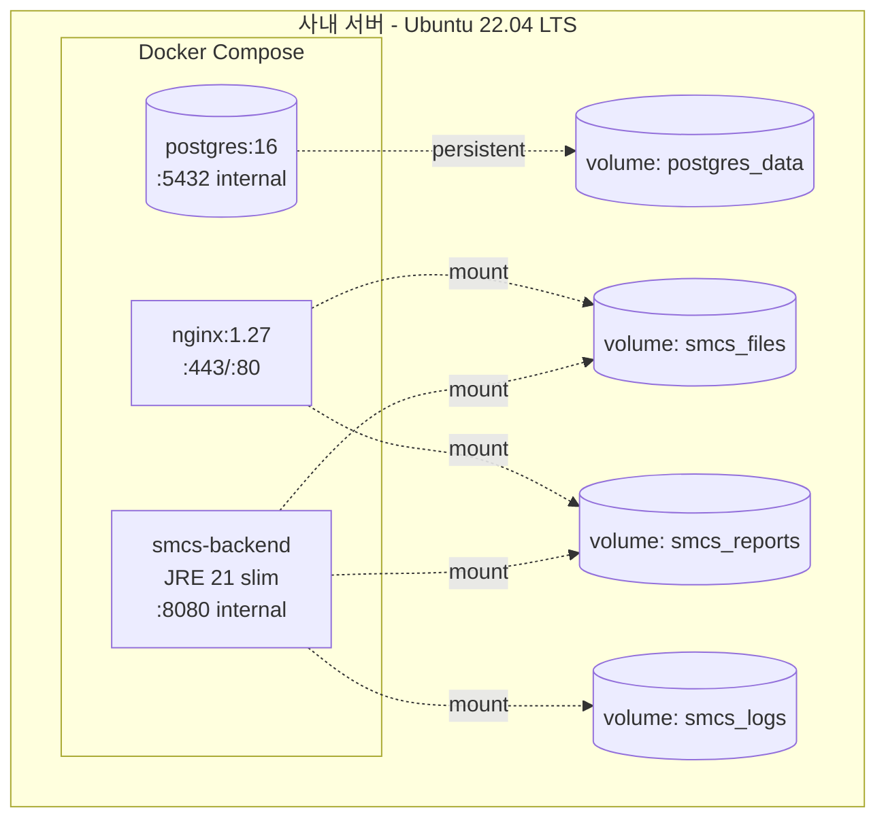
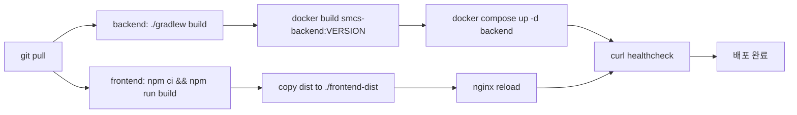

# 10. Deployment Architecture

## 10.1 토폴로지 (단일 호스트)



## 10.2 docker-compose.yml (요약)

```yaml
services:
  nginx:
    image: nginx:1.27-alpine
    ports: ["80:80", "443:443"]
    volumes:
      - ./nginx/nginx.conf:/etc/nginx/nginx.conf:ro
      - ./certs:/etc/nginx/certs:ro
      - smcs_files:/var/smcs/files:ro
      - smcs_reports:/var/smcs/reports:ro
      - ./frontend-dist:/usr/share/nginx/html:ro
    depends_on: [backend]
    restart: unless-stopped

  backend:
    image: smcs-backend:latest
    environment:
      SPRING_PROFILES_ACTIVE: prod
      SPRING_DATASOURCE_URL: jdbc:postgresql://postgres:5432/smcs
      SPRING_DATASOURCE_USERNAME: smcs
      SPRING_DATASOURCE_PASSWORD_FILE: /run/secrets/db_password
      SMCS_DATA_KEY_FILE: /run/secrets/data_key
      SMCS_HMAC_KEY_FILE: /run/secrets/hmac_key
      SMCS_JWT_SECRET_FILE: /run/secrets/jwt_secret
      TZ: Asia/Seoul
    secrets: [db_password, data_key, hmac_key, jwt_secret]
    volumes:
      - smcs_files:/var/smcs/files
      - smcs_reports:/var/smcs/reports
      - smcs_logs:/var/smcs/logs
    depends_on: [postgres]
    restart: unless-stopped

  postgres:
    image: postgres:16-alpine
    environment:
      POSTGRES_DB: smcs
      POSTGRES_USER: smcs
      POSTGRES_PASSWORD_FILE: /run/secrets/db_password
      TZ: Asia/Seoul
    volumes:
      - postgres_data:/var/lib/postgresql/data
    secrets: [db_password]
    restart: unless-stopped

volumes:
  postgres_data:
  smcs_files:
  smcs_reports:
  smcs_logs:

secrets:
  db_password:
    file: ./secrets/db_password
  data_key:
    file: ./secrets/data_key
  hmac_key:
    file: ./secrets/hmac_key
  jwt_secret:
    file: ./secrets/jwt_secret
```

## 10.3 Nginx 핵심 라우팅 (요약)

```nginx
server {
    listen 443 ssl http2;
    server_name smcs.internal;

    ssl_certificate     /etc/nginx/certs/smcs.crt;
    ssl_certificate_key /etc/nginx/certs/smcs.key;
    add_header Strict-Transport-Security "max-age=31536000" always;

    # SPA
    root /usr/share/nginx/html;
    location / {
        try_files $uri /index.html;
    }

    # API
    location /api/ {
        proxy_pass http://backend:8080;
        proxy_set_header X-Real-IP $remote_addr;
        client_max_body_size 11m;  # 첨부 10MB + 여유
    }

    # 첨부 파일 — X-Accel-Redirect 경로
    location /files/ {
        auth_request /api/files/check;
        return 302 /protected$uri;
    }
    location /protected/ {
        internal;
        alias /var/smcs/files/;
        expires 1h;
    }

    # 보고서 PDF — 동일 패턴
    location /reports/ {
        auth_request /api/files/check?type=report;
        return 302 /protected-reports$uri;
    }
    location /protected-reports/ {
        internal;
        alias /var/smcs/reports/;
    }
}

server {
    listen 80;
    return 301 https://$host$request_uri;
}
```

## 10.4 빌드 & 배포 워크플로우



- MVP는 **수동 배포** (1인 개발). CI/CD는 v2.
- 무중단 배포 불필요. 야간 점검 시간(00:00~01:00) 활용.
- 롤백: 이전 이미지 태그로 `docker compose up -d` 재실행.

## 10.5 백업 & 복구

| 대상 | 방식 | 주기 | 보관 | 암호화 |
|------|------|------|------|--------|
| PostgreSQL | `pg_dump -Fc \| gpg --symmetric --cipher-algo AES256` | 매일 02:00 | 30일 | ✅ GPG (대칭키) |
| 첨부 파일 | `tar czf - … \| gpg --symmetric` → 백업 서버 또는 외장 스토리지 | 매일 03:00 | 90일 | ✅ GPG |
| 보고서 PDF | 동일 방식 | 매일 03:00 | 90일 (원본도 90일 후 삭제) | ✅ GPG |
| 시크릿 | 별도 보안 저장소 (사내 패스워드 매니저) | 변경 시 | 영구 | ✅ (매니저 자체 암호화) |

**백업 복호화 키 관리:**
- GPG 대칭키 패스프레이즈는 **백업 저장소와 분리된 위치**(사내 패스워드 매니저)에 보관.
- DB 마스터키(`SMCS_DATA_KEY`)와 백업 GPG 키는 **다른 키**로 분리한다 (열쇠 한 개로 모든 곳 열리지 않도록).
- 키 회전 절차는 OPERATIONS.md에 명시.

**가용성(NFR5) 운영 정의:**
- **목표 가동률:** 월간 99% (다운타임 ≤ 7시간/월)
- **제외 대상:** 사전 공지된 계획 점검 (주간 30분 이내, 야간 00:00~01:00), 사내 네트워크/인프라 장애
- **RTO(복구 목표 시간):** 4시간 — Docker Compose 재기동 + 백업 복원 시나리오 기준
- **RPO(복구 시점 목표):** 24시간 — 일일 백업 기준 (최대 24시간 분량 데이터 손실 허용)
- **단일 호스트 SPOF 인지:** MVP는 단일 호스트로 운영. 99.9%+ 가동률이 필요해지면 v2에서 (a) DB 분리, (b) Backup Hot-Standby 도입 검토.

복구 절차 상세는 OPERATIONS.md에 별도 작성.

---
