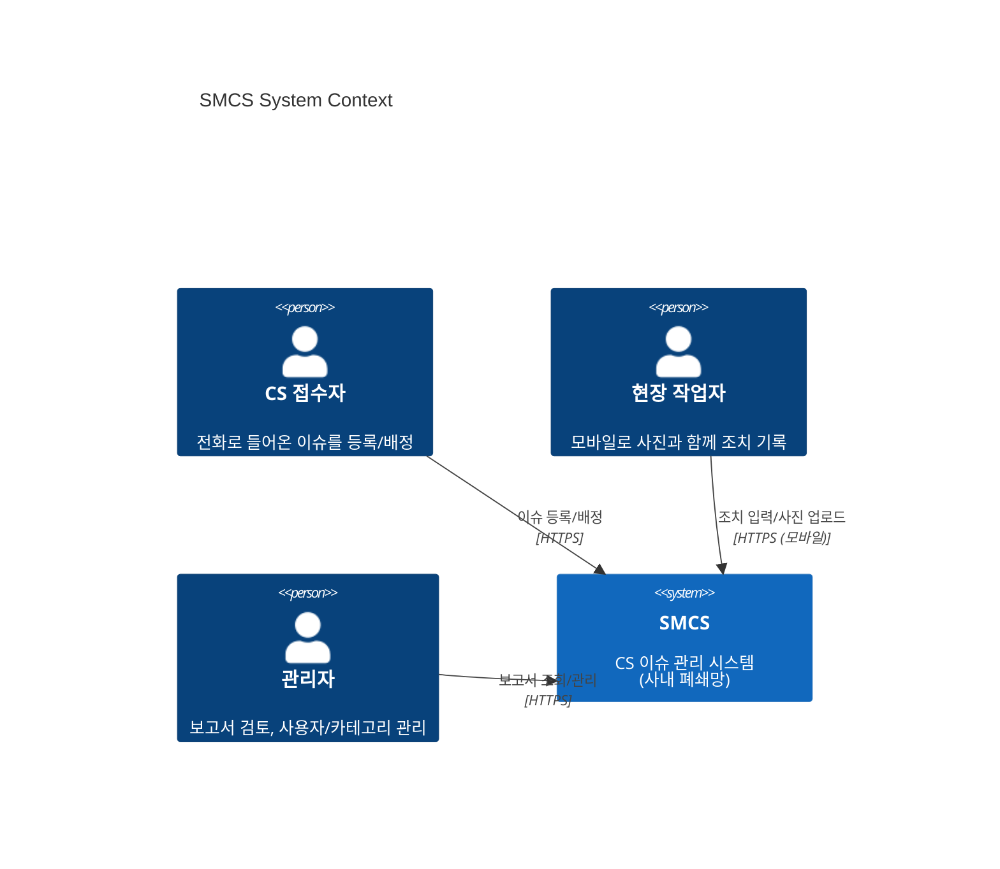

# 2. System Context (C4 Level 1)

```mermaid
C4Context
    title SMCS System Context

    Person(agent, "CS 접수자", "전화로 들어온 이슈를 등록/배정")
    Person(field, "현장 작업자", "모바일로 사진과 함께 조치 기록")
    Person(admin, "관리자", "보고서 검토, 사용자/카테고리 관리")

    System(smcs, "SMCS", "CS 이슈 관리 시스템<br/>(사내 폐쇄망)")

    Rel(agent, smcs, "이슈 등록/배정", "HTTPS")
    Rel(field, smcs, "조치 입력/사진 업로드", "HTTPS (모바일)")
    Rel(admin, smcs, "보고서 조회/관리", "HTTPS")
```

**외부 시스템 연결 없음** — 메신저, SMTP, SMS, SSO, 클라우드 스토리지 등 어떤 외부 시스템과도 통신하지 않는다.

---
