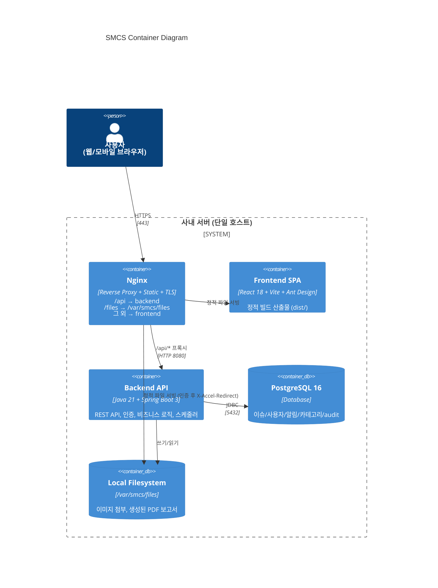

# 3. Container Architecture (C4 Level 2)

## 3.1 컨테이너 책임

| 컨테이너 | 책임 | 비책임 |
|---------|------|--------|
| **Nginx** | TLS termination, 라우팅, 정적 파일 서빙, 인증 게이트(X-Accel-Redirect) | 비즈니스 로직 |
| **Frontend SPA** | UI 렌더링, 사용자 입력, API 호출, 알림 polling | 인증 검증 (UI만, 권위는 backend) |
| **Backend API** | 인증/권한, 도메인 로직, 트랜잭션, 스케줄러, PDF 생성, 알림 생성 | 정적 파일 직접 서빙(Nginx에 위임) |
| **PostgreSQL** | 영속성 단일 소스 | 검색 엔진(MVP는 LIKE/ILIKE로 충분) |
| **Local Filesystem** | 첨부 이미지, PDF 보고서 저장 | 캐시 (없음 — 항상 디스크) |

## 3.2 왜 Redis를 안 쓰는가?

- 70명 동시 사용에 세션/캐시 필요성 낮음
- JWT가 무상태 → 세션 스토어 불필요
- 폴링 알림은 DB 카운트 쿼리로 충분 (`SELECT COUNT(*) WHERE recipient_id=? AND read_at IS NULL` + 인덱스)
- v2에서 동시 사용자 증가 또는 WebSocket 도입 시 추가 검토

## 3.3 왜 메시지 큐를 안 쓰는가?

- 알림 생성이 동일 트랜잭션 내 INSERT로 충분 (실시간성 요구 낮음, 30s polling)
- 보고서 생성 = Spring `@Scheduled` 한 번에 처리 (분당 1건 미만)
- 외부 발송 없음 → 비동기 분리 동기 부족

---
