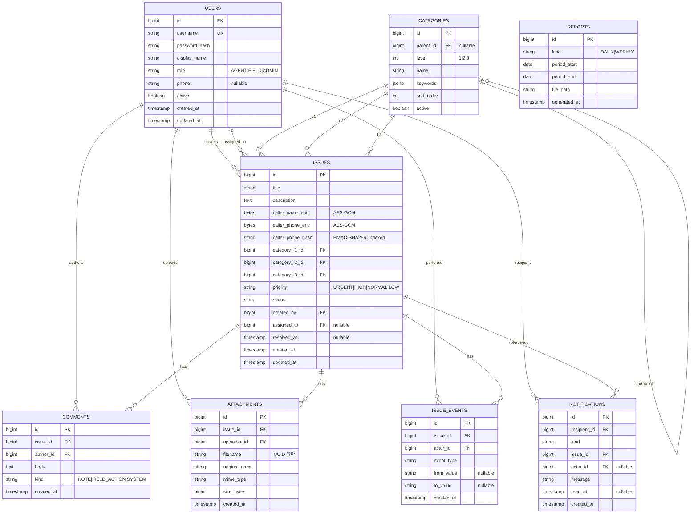

# 5. Data Architecture

## 5.1 ER Diagram

## 5.2 핵심 인덱스 전략

| 테이블 | 인덱스 | 사용처 |
|--------|--------|--------|
| `issues` | `(priority, created_at)` 복합 | 기본 정렬 (PRD FR4) |
| `issues` | `(status)` | 상태 필터 |
| `issues` | `(assigned_to, status)` | 현장 작업자 모바일 홈 |
| `issues` | `(category_l1_id)`, `(category_l2_id)`, `(category_l3_id)` | 카테고리 필터 |
| `issues` | `(caller_phone_hash)` | 발신자 전화번호 검색 |
| `issues` | `(created_at)` | 보고서 집계 |
| `comments` | `(issue_id, created_at)` | 활동 로그 시간순 |
| `attachments` | `(issue_id)` | 첨부 조회 |
| `issue_events` | `(issue_id, created_at)` | audit timeline |
| `notifications` | `(recipient_id, read_at)` | 미읽음 카운트 |
| `notifications` | `(recipient_id, created_at)` | 알림 리스트 |
| `categories` | `(parent_id, level, sort_order)` | 계층 조회 |

## 5.3 검색 전략 (PRD FR15)

| 검색 대상 | 방식 | 비고 |
|----------|------|------|
| 제목 | `ILIKE '%kw%'` | PostgreSQL trigram 인덱스 검토 (선택) |
| 본문 | `ILIKE '%kw%'` | 동상 |
| 발신자 이름 | **검색 불가 (MVP)** | 평문 노출 위험 vs 검색 가치 트레이드오프. 정확 매칭만 v2에서 추가 |
| 발신자 전화번호 | **HMAC 해시 정확 매칭** | 정규화(숫자만) 후 HMAC-SHA256 → `caller_phone_hash` 컬럼 비교 |

> 부분 매칭 전화번호 검색은 보안상 미지원. "010-1234-5678" 입력 시 정확히 그 번호만 매칭.

## 5.4 시드 데이터

- **프로덕션 시드** (Flyway `V2__seed_categories.sql`):
  - L1: 아파트먼트v1, 아파트먼트v2, voip/pbx
  - L2: 관리자웹, 입주민앱, 단말, 서버
  - L3: 기기미동작, 기기오동작, 로그인오류
  - keywords는 빈 배열로 시작 → 운영하면서 Admin이 채움
- **개발 시드** (`application-local.yml` 활성 시 `DataLoader`):
  - 사용자 8명, 샘플 이슈 20건 (다양한 우선순위/카테고리/상태)

## 5.5 데이터 보존 정책

| 데이터 | 보존 기간 | 정리 방식 |
|--------|----------|----------|
| Issue, Comment, Attachment, IssueEvent | **영구** | 삭제하지 않음 |
| Notification | 90일 | 일일 cron `cleanup-old-files.sh` |
| Report PDF | 90일 | 일일 cron |
| Audit Log (별도 로그파일) | 1년 | logrotate |
| DB 백업 | 30일 | `backup-db.sh` 일일 실행, 30일치 보관 |

---
