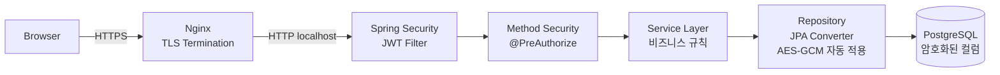

# 6. Security Architecture (Defense in Depth)

## 6.1 보안 계층



## 6.2 인증 (Authentication)

- **방식:** 사용자명/비밀번호 → JWT
- **토큰 수명:** 8시간 (PRD NFR8)
- **토큰 클레임:** `sub=userId`, `role`, `iat`, `exp`
- **서명:** HMAC-SHA (JJWT 0.12.x 의 `signWith(SecretKey)` 가 시크릿 길이에 따라 자동 선택 — 32 bytes → HS256, 48 bytes → HS384, 64 bytes → HS512). 시크릿은 `application-prod.yml` (Git 미포함). MVP 의 dev/prod 시크릿은 64 bytes → 실제 적용 알고리즘은 **HS512**.
- **저장:** 클라이언트 메모리 + `localStorage` (PRD §1.4 Story 1.4)
- **갱신:** MVP는 만료 시 재로그인. Refresh Token은 v2.
- **비밀번호:** BCrypt (cost 10).

## 6.3 권한 (Authorization)

| 리소스/액션 | AGENT | FIELD | ADMIN |
|------------|:-----:|:-----:|:-----:|
| 이슈 생성 | ✅ | ❌ | ✅ |
| 이슈 조회 (모든) | ✅ | 본인 배정만 | ✅ |
| 이슈 수정 | ✅ | 본인 배정만 (제한적) | ✅ |
| 담당자 배정 | ✅ | ❌ | ✅ |
| 상태 전이 (NEW→ASSIGNED) | ✅ | ❌ | ✅ |
| 상태 전이 (IN_PROGRESS→DONE) | ✅ | 본인 배정 시 | ✅ |
| 검수 (DONE→VERIFIED) | ✅ | ❌ | ✅ |
| 코멘트 작성 | ✅ | ✅ | ✅ |
| 사진 업로드 | ✅ | ✅ | ✅ |
| 보고서 조회 | ❌ | ❌ | ✅ |
| CSV 내보내기 | ❌ | ❌ | ✅ |
| 사용자/카테고리 관리 | ❌ | ❌ | ✅ |

- 구현: Spring Security `@PreAuthorize("hasRole('ADMIN')")` 등 메서드 어노테이션 + 도메인 서비스에서 추가 검증(예: 본인 배정 이슈인지).

## 6.4 컬럼 암호화 (Encryption at Rest)

- **대상 컬럼:** `issues.caller_name_enc`, `issues.caller_phone_enc`
- **알고리즘:** AES-256-GCM (인증된 암호화)
- **키 관리:**
  - MVP: `application-prod.yml`의 환경변수 `SMCS_DATA_KEY` (Base64 32바이트)
  - v2: HashiCorp Vault 또는 사내 KMS 도입
  - **키 회전 절차**는 OPERATIONS.md에 별도 문서화 (재암호화 배치 필요)
- **IV(Nonce):** 매 암호화마다 랜덤 12바이트, ciphertext에 prepend
- **구현:**
  ```java
  // crypto/EncryptedStringConverter.java
  @Converter
  public class EncryptedStringConverter implements AttributeConverter<String, byte[]> {
      // entity 필드는 String, DB 컬럼은 bytea
      // AES-GCM 자동 적용
  }
  ```

## 6.5 검색 해시 (Searchable Encryption)

- **대상:** `issues.caller_phone_hash`
- **알고리즘:** HMAC-SHA256
- **키:** 별도 `SMCS_HMAC_KEY` (암호화 키와 분리)
- **정규화:** 숫자만 추출 후 HMAC 적용 → `01012345678` → HMAC
- **사용:** 검색 시 입력 정규화 → HMAC → `WHERE caller_phone_hash = ?`
- **트레이드오프:**
  - ✅ 정확 매칭 가능, 평문 노출 없음
  - ⚠️ 부분 매칭/와일드카드 불가
  - ⚠️ HMAC 키가 유출되면 rainbow 공격 가능 → 환경변수 보호 필수

## 6.6 파일 업로드 보안

| 단계 | 검증 |
|------|------|
| 클라이언트 | MIME 화이트리스트 (image/jpeg, image/png), 크기 10MB |
| Multipart 파싱 | Spring Boot 기본 (`spring.servlet.multipart.max-file-size=10MB`) |
| 서버 검증 | Magic byte 확인 (JPEG: `FF D8 FF`, PNG: `89 50 4E 47`) — JPEG/PNG 위장 거부 |
| **EXIF 스트립** | `metadata-extractor` 또는 `Thumbnailator` 사용. 메타데이터 모두 제거 후 저장 |
| 저장 파일명 | UUID 기반 (`{uuid}.jpg`), 사용자 입력 파일명 사용 금지 (path traversal 방지) |
| 저장 경로 | `/var/smcs/files/{yyyy}/{mm}/{uuid}.jpg` (월별 디렉터리) |
| 서빙 | Nginx X-Accel-Redirect — Spring이 권한 확인 후 헤더로 위임. 직접 디스크 노출 X |

## 6.7 EXIF 스트립 처리 (사용자 결정에 따라 자동)

```java
// attachment/ExifStripper.java
public byte[] strip(byte[] input, String mimeType) {
    // JPEG: javax.imageio.ImageIO.read → write (메타데이터 자동 손실)
    // 또는 thumbnailator의 .outputQuality(0.95).outputFormat("jpg").asByteArray()
    // PNG: 동일하게 ImageIO로 리라이트
}
```
- 손실 압축 최소화를 위해 JPEG 품질 95 유지
- GPS, 카메라 모델, 촬영 시각 등 모든 메타데이터 제거
- v2에서 GPS 기능이 필요해지면 별도 명시적 필드(`location_lat`, `location_lng`)로 수신

## 6.8 Rate Limiting

**도구:** Bucket4j `bucket4j-core` 직접 사용 + 커스텀 `OncePerRequestFilter` (`RateLimitFilter`). Story 1.3 구현 시 `bucket4j-spring-boot-starter 0.12.x` + Caffeine 통합이 Bucket4j 8.x 패키지 재구조화와 호환성 충돌 (`No Bucket4j cache configuration found - cache-to-use: caffeine`) → starter 제거하고 core 만 직접 사용. **버킷 저장소**: `ConcurrentHashMap<Long, Bucket>` (in-memory, 단일 호스트 환경에 적합)

| 대상 엔드포인트 | 키 | 제한 | 결과 |
|----------------|------|------|------|
| `POST /api/auth/login` | username + IP 조합 | 5회/10분 | 6회째 → 423 Locked + 카운터 리셋 타이머 |
| `/api/*` (전체) | JWT sub (사용자ID) | 300회/분 | 초과 시 429 Too Many Requests + `Retry-After` 헤더 |
| `POST /api/issues/{id}/attachments` | 사용자ID | 30회/분 | 사진 업로드 폭주 방지 |
| `GET /api/notifications/unread-count` | 사용자ID | 120회/분 | Polling 여유 (30s 정상치의 2배) |

**구현 노트:**
- in-memory Bucket — 재시작 시 카운터 리셋. MVP에 충분.
- 분산 환경 필요 시 v2에서 Redis 기반 Bucket4j로 교체.
- Lockout 상태(`/api/auth/login` 5회 실패)는 DB의 `login_attempt` 테이블에도 기록(감사 + 재기동 시 복원).

## 6.9 기타 보안 설정

| 항목 | 설정 |
|------|------|
| HTTPS | Nginx에서 강제. HTTP → HTTPS 리다이렉트 |
| HSTS | `max-age=31536000; includeSubDomains` |
| CSP | `default-src 'self'; img-src 'self' data:; style-src 'self' 'unsafe-inline'` |
| X-Frame-Options | `DENY` |
| X-Content-Type-Options | `nosniff` |
| CORS | 동일 도메인 배포 → CORS 비활성 (Nginx 프록시) |
| 비밀번호 정책 | 최소 8자, 영문+숫자. 복잡도는 운영 정책 따름 |
| 로그인 실패 lockout | MVP는 단순 카운터 (5회 실패 시 10분 lockout). 분산 환경 고려 X |
| SQL Injection | Spring Data JPA 파라미터 바인딩으로 자동 방지 |
| XSS | React 기본 이스케이프. `dangerouslySetInnerHTML` 사용 금지 |
| 감사 로그 | IssueEvent + 별도 Logback file appender. 개인정보 마스킹 필수 |
| 개인정보 마스킹 (로그) | 전화번호: `010-****-5678`, 이름: `홍*동` |

---
