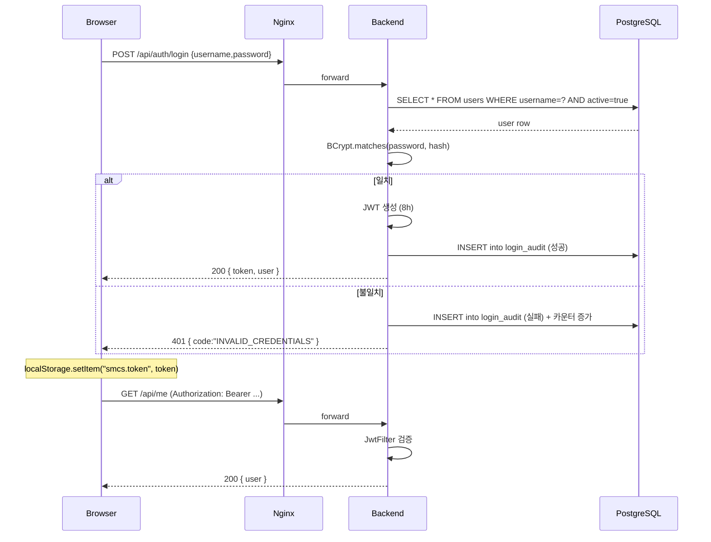
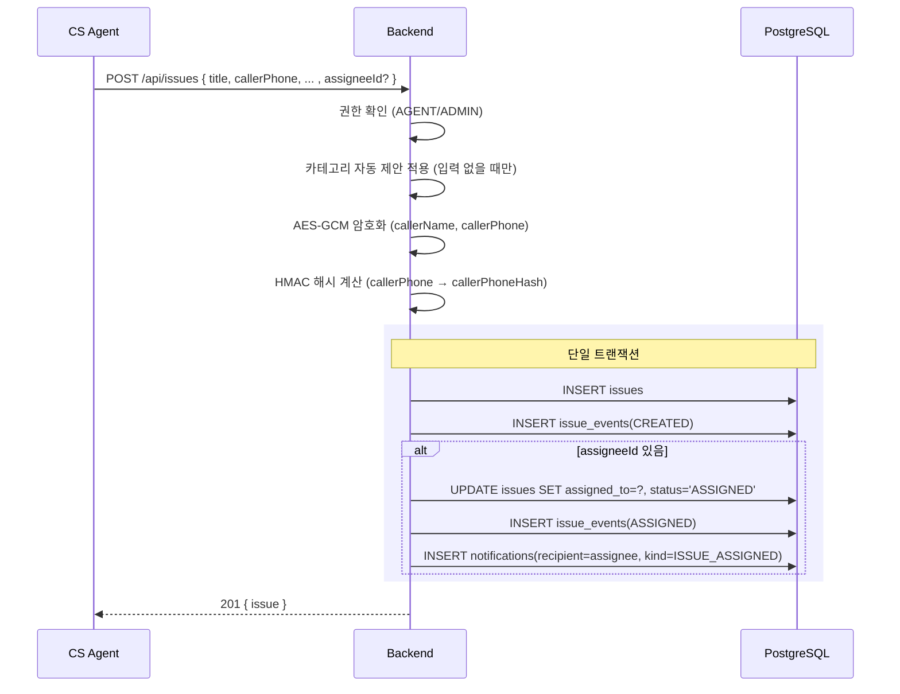
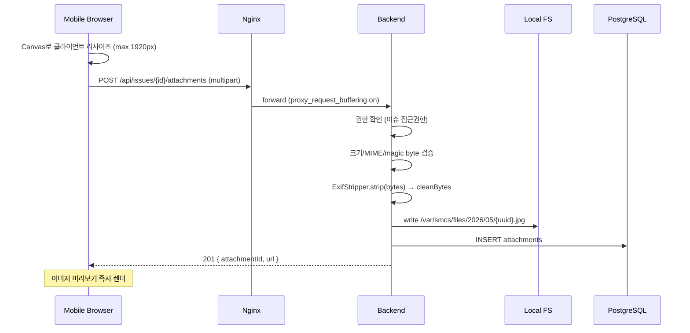
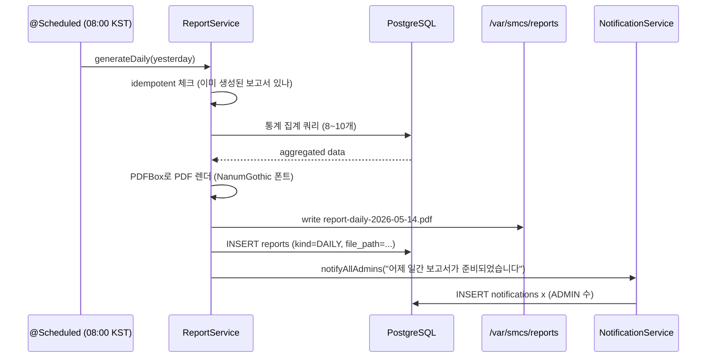
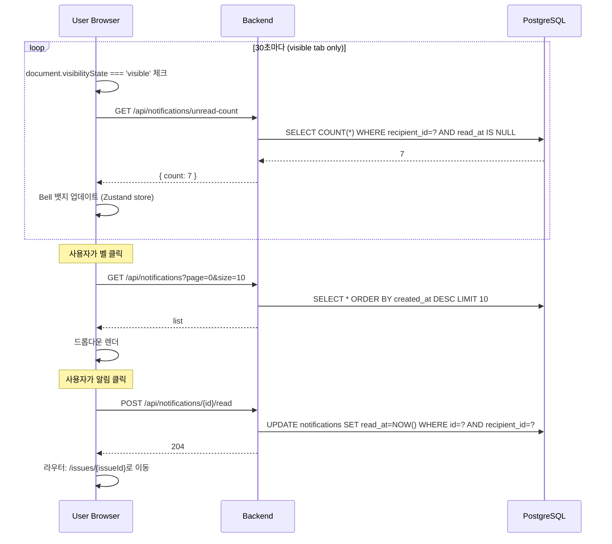
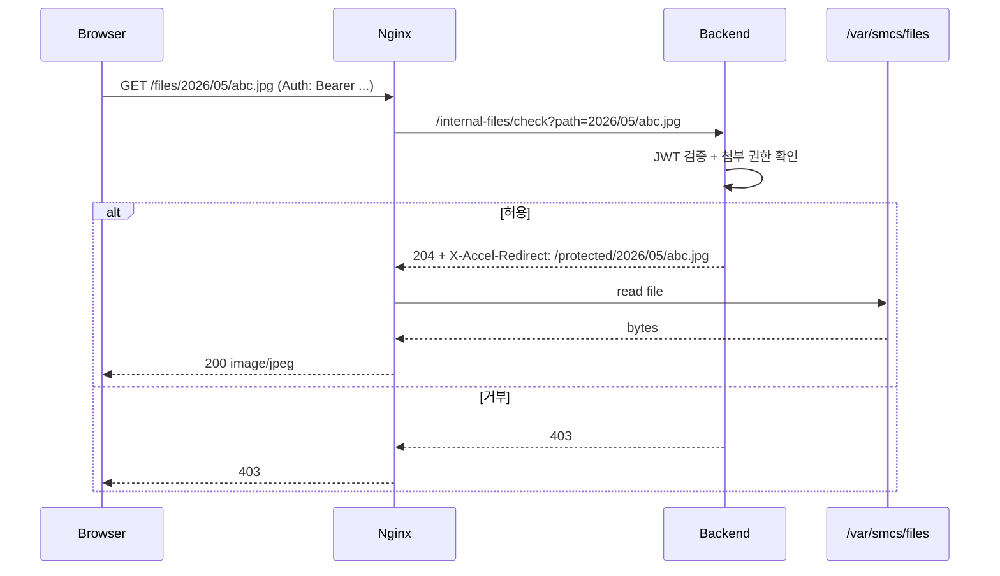

# 8. Sequence Flows

## 8.1 로그인 흐름

## 8.2 이슈 등록 + 알림 트리거 (배정 포함 시)

## 8.3 이미지 업로드 (EXIF 스트립 포함)

## 8.4 보고서 자동 생성 스케줄러

## 8.5 알림 Polling (Frontend)

## 8.6 정적 파일 보안 서빙 (X-Accel-Redirect)

---
