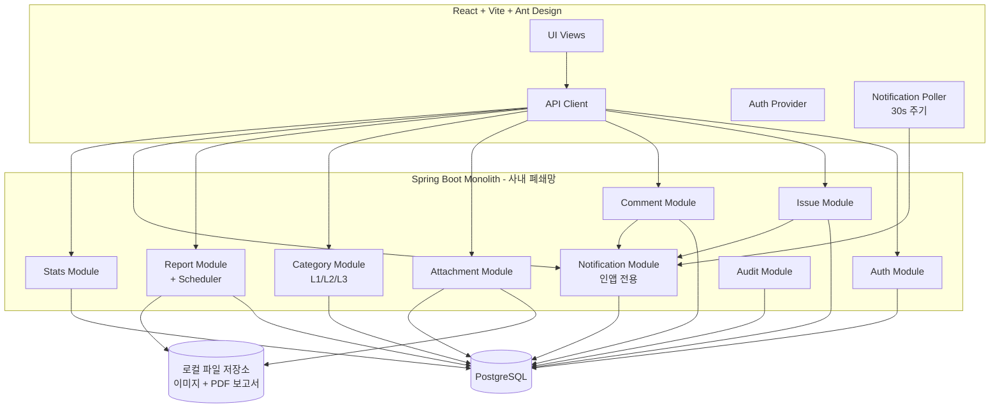

# 7. Components

## 7.1 Backend (Spring Boot)

| 컴포넌트 | 책임 | 주요 의존성 |
|---------|------|------------|
| **Auth Module** | 로그인/JWT 발급, 권한 검증, 사용자 관리 | Spring Security |
| **Issue Module** | 이슈 CRUD, 상태 전이, 배정 로직 | JPA, Auth |
| **Comment Module** | 코멘트/현장 조치 기록 | JPA, Issue |
| **Attachment Module** | 이미지 업로드/저장/서빙 | 로컬 파일 시스템 |
| **Category Module** | 카테고리 마스터 (L1/L2/L3), 자동 분류 룰 | JPA |
| **Report Module** | PDF 보고서 생성, 통계 집계, 보고서 보관함 | PDFBox, 스케줄러 |
| **Notification Module** | 인앱 알림 생성/조회/읽음 처리. 외부 발송 없음 | JPA |
| **Stats Module** | 대시보드 통계 API | JPA |
| **Audit Module** | IssueEvent 자동 기록 | AOP / JPA Listener |

## 7.2 Frontend (React + TS)

| 컴포넌트 | 책임 |
|---------|------|
| **AuthProvider** | JWT 보관(메모리+localStorage), 자동 갱신, 인터셉터 |
| **IssueListView** | CS/Admin 메인 리스트 화면, 필터/검색 |
| **IssueFormView** | 신규 이슈 등록 폼 |
| **IssueDetailView** | 이슈 상세, 코멘트, 활동 로그, 상태 전이 |
| **MobileFieldView** | 현장 작업자 모바일 메인 (내 작업 카드 스택) |
| **MobileFieldDetailView** | 사진 업로드 + 조치 입력 + 완료 처리 |
| **DashboardView** | 차트 + 통계 카드 |
| **ReportsView** | 보고서 보관함 리스트 + PDF 미리보기/다운로드 |
| **NotificationBell** | 헤더 벨 아이콘 + 미읽음 뱃지 + 드롭다운 |
| **AdminView** | 사용자/카테고리(L1/L2/L3) 관리 |
| **Shared UI Kit** | 버튼, 폼, 모달, 우선순위 색상 뱃지 등 공통 컴포넌트 |

## 7.3 Component Diagram (Mermaid)

> **외부 시스템 연결 없음.** 카카오워크/슬랙/SMTP/SMS 등 어떠한 외부 시스템에도 의존하지 않는다.

---
